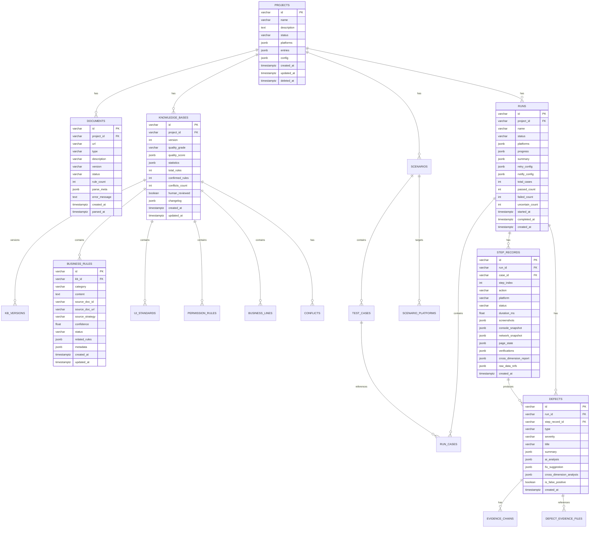

# AutoTest — 数据库设计文档 (Database Design)

> 版本: 1.0 | 最后更新: 2026-05-14 | 状态: 初始草稿
> 基于 SDD (Specification-Driven Development) 方法

---

## 修订历史

| 版本 | 日期 | 修订人 | 修订内容 |
|------|------|--------|----------|
| 1.0 | 2026-05-14 | AutoTest 架构组 | 初始数据库设计 |

---

## 目录

1. [设计原则](#1-设计原则)
2. [ER 总图](#2-er-总图)
3. [表定义](#3-表定义)
4. [索引策略](#4-索引策略)
5. [分区策略](#5-分区策略)
6. [数据归档](#6-数据归档)
7. [配置表与枚举](#7-配置表与枚举)
8. [数据库管理与运维](#8-数据库管理与运维)

---

## 1. 设计原则

### 1.1 总体原则

```
1. 领域驱动: 表结构映射领域模型，一个实体一张主表
2. JSONB 优先: 灵活/变长的结构化数据使用 JSONB
3. 不可变日志: 执行记录和缺陷数据不可修改，只有 INSERT 和软删除
4. 分区表: 大数据量表（execution_records, step_records）按时间/项目分区
5. 审计字段: 每张表包含 created_at, updated_at
6. 软删除: 核心业务表使用 is_deleted 或 deleted_at
7. 外键: 使用逻辑外键（由应用层保证），避免物理外键带来的锁和迁移问题
8. 命名约定: snake_case，表名复数，主键 id 统一为 UUID 风格 varchar
```

### 1.2 命名约定

```yaml
表名: snake_case 复数 (projects, runs, scenarios)
字段名: snake_case (created_at, project_id)
主键: id varchar(32) (proj_xxx / run_xxx 格式)
外键: {referenced_table_singular}_id (project_id, run_id)
索引: idx_{table}_{column1}_{column2}
唯一约束: uq_{table}_{column1}_{column2}
时间字段: created_at, updated_at, deleted_at
```

### 1.3 ID 生成规则

```
格式: {前缀}_{12位随机字符串}
示例: proj_a1b2c3d4e5f6

前缀对照:
  proj_  → projects
  doc_   → documents
  kb_    → knowledge_bases
  ver_   → kb_versions
  rule_  → business_rules
  ui_    → ui_standards
  perm_  → permission_rules
  bl_    → business_lines
  sce_   → scenarios
  tc_    → test_cases
  run_   → runs
  step_  → step_records
  def_   → defects
  chain_ → evidence_chains
  conf_  → conflicts
  file_  → files
  task_  → async_tasks
```

---

## 2. ER 总图



---

## 3. 表定义

### 3.1 projects — 项目表

```sql
CREATE TABLE projects (
    id              VARCHAR(32) PRIMARY KEY,       -- proj_{随机12位}
    name            VARCHAR(255) NOT NULL,
    description     TEXT,
    status          VARCHAR(32) NOT NULL DEFAULT 'created',
                    -- created | parsing | ready | running | completed | archived
    platforms       JSONB NOT NULL DEFAULT '[]',   -- ["web", "android", "ios"]
    entries         JSONB NOT NULL DEFAULT '[]',    -- 平台入口配置
    config          JSONB DEFAULT '{}',             -- 项目配置
    created_at      TIMESTAMPTZ NOT NULL DEFAULT NOW(),
    updated_at      TIMESTAMPTZ NOT NULL DEFAULT NOW(),
    deleted_at      TIMESTAMPTZ
);

COMMENT ON TABLE projects IS '测试项目';
COMMENT ON COLUMN projects.entries IS '[{"platform":"web","url":"...","viewport":{}}, ...]';
COMMENT ON COLUMN projects.config IS '{"timeout": 30000, "retry": 3, ...}';
```

### 3.2 documents — 文档表

```sql
CREATE TABLE documents (
    id              VARCHAR(32) PRIMARY KEY,       -- doc_{随机12位}
    project_id      VARCHAR(32) NOT NULL,
    url             TEXT NOT NULL,
    type            VARCHAR(32) NOT NULL,          -- prd | ui_spec | api_doc | other
    description     VARCHAR(500),
    version         VARCHAR(32),
    status          VARCHAR(32) NOT NULL DEFAULT 'pending',
                    -- pending | fetching | parsing | completed | failed
    rule_count      INT DEFAULT 0,
    parse_meta      JSONB DEFAULT '{}',
    error_message   TEXT,
    created_at      TIMESTAMPTZ NOT NULL DEFAULT NOW(),
    parsed_at       TIMESTAMPTZ,
    updated_at      TIMESTAMPTZ NOT NULL DEFAULT NOW(),
    
    CONSTRAINT fk_documents_project
        FOREIGN KEY (project_id) REFERENCES projects(id)
);

CREATE INDEX idx_documents_project_id ON documents(project_id);
CREATE INDEX idx_documents_status ON documents(status) WHERE status = 'pending';

COMMENT ON TABLE documents IS '项目需求文档引用';
COMMENT ON COLUMN documents.parse_meta IS '{"chapters": 12, "strategies_used": ["general"], ...}';
```

### 3.3 document_raw_contents — 文档原始内容表

```sql
CREATE TABLE document_raw_contents (
    id              VARCHAR(32) PRIMARY KEY,
    document_id     VARCHAR(32) NOT NULL UNIQUE,
    raw_markdown    TEXT,
    extracted_at    TIMESTAMPTZ NOT NULL DEFAULT NOW(),
    content_hash    VARCHAR(64),                    -- SHA-256，用于检测变动
    metadata        JSONB DEFAULT '{}',             -- 文档元数据
    
    CONSTRAINT fk_doc_raw_document
        FOREIGN KEY (document_id) REFERENCES documents(id)
);

COMMENT ON TABLE document_raw_contents IS '文档原始内容（缓存，减少重复拉取）';
```

### 3.4 knowledge_bases — 知识库表

```sql
CREATE TABLE knowledge_bases (
    id              VARCHAR(32) PRIMARY KEY,       -- kb_{随机12位}
    project_id      VARCHAR(32) NOT NULL,
    version         INT NOT NULL DEFAULT 1,
    quality_grade   VARCHAR(4),                    -- S/A/B/C/D
    quality_score   JSONB DEFAULT '{}',            -- 详细评分
    statistics      JSONB DEFAULT '{}',
    total_rules     INT DEFAULT 0,
    confirmed_rules INT DEFAULT 0,
    conflicts_count INT DEFAULT 0,
    human_reviewed  BOOLEAN DEFAULT FALSE,
    changelog       JSONB DEFAULT '[]',
    created_at      TIMESTAMPTZ NOT NULL DEFAULT NOW(),
    updated_at      TIMESTAMPTZ NOT NULL DEFAULT NOW(),
    
    CONSTRAINT fk_kb_project
        FOREIGN KEY (project_id) REFERENCES projects(id)
);

CREATE INDEX idx_kb_project_id ON knowledge_bases(project_id);
CREATE INDEX idx_kb_project_version ON knowledge_bases(project_id, version);

COMMENT ON TABLE knowledge_bases IS '知识库（版本化管理）';
COMMENT ON COLUMN knowledge_bases.changelog IS '[{"version":1,"change":"初始构建","rules_count":45}, ...]';
```

### 3.5 business_rules — 业务规则表

```sql
CREATE TABLE business_rules (
    id              VARCHAR(32) PRIMARY KEY,       -- rule_{随机12位}
    kb_id           VARCHAR(32) NOT NULL,
    category        VARCHAR(32) NOT NULL,          -- flow | rule | permission | ui
    content         TEXT NOT NULL,
    source_doc_id   VARCHAR(32),
    source_doc_url  TEXT,
    source_strategy VARCHAR(32),                   -- general | structured | multi_round | reverse
    confidence      REAL NOT NULL DEFAULT 0.0,     -- 0.0 ~ 1.0
    status          VARCHAR(16) NOT NULL DEFAULT 'candidate',
                    -- confirmed | candidate | conflicted | rejected
    related_rules   JSONB DEFAULT '[]',
    metadata        JSONB DEFAULT '{}',
    created_at      TIMESTAMPTZ NOT NULL DEFAULT NOW(),
    updated_at      TIMESTAMPTZ NOT NULL DEFAULT NOW(),
    
    CONSTRAINT fk_rules_kb
        FOREIGN KEY (kb_id) REFERENCES knowledge_bases(id)
);

CREATE INDEX idx_rules_kb_id ON business_rules(kb_id);
CREATE INDEX idx_rules_category ON business_rules(kb_id, category);
CREATE INDEX idx_rules_status ON business_rules(kb_id, status);

COMMENT ON TABLE business_rules IS 'AI 从文档中提取的业务规则';
```

### 3.6 ui_standards — UI 标准表

```sql
CREATE TABLE ui_standards (
    id              VARCHAR(32) PRIMARY KEY,       -- ui_{随机12位}
    kb_id           VARCHAR(32) NOT NULL,
    component_type  VARCHAR(64),                   -- button | input | card | modal | ...
    property        VARCHAR(64),                   -- color | fontSize | borderRadius | ...
    expected_value  TEXT NOT NULL,
    confidence      REAL NOT NULL DEFAULT 0.0,
    source_doc_id   VARCHAR(32),
    status          VARCHAR(16) DEFAULT 'candidate',
    created_at      TIMESTAMPTZ NOT NULL DEFAULT NOW(),
    updated_at      TIMESTAMPTZ NOT NULL DEFAULT NOW(),
    
    CONSTRAINT fk_ui_kb
        FOREIGN KEY (kb_id) REFERENCES knowledge_bases(id)
);

CREATE INDEX idx_ui_kb ON ui_standards(kb_id);

COMMENT ON TABLE ui_standards IS '可量化的 UI 规范标准';
```

### 3.7 permission_rules — 权限规则表

```sql
CREATE TABLE permission_rules (
    id              VARCHAR(32) PRIMARY KEY,
    kb_id           VARCHAR(32) NOT NULL,
    role            VARCHAR(64) NOT NULL,
    resource        VARCHAR(255) NOT NULL,
    action          VARCHAR(64) NOT NULL,          -- create | read | update | delete | export
    allowed         BOOLEAN NOT NULL,
    condition       TEXT,
    confidence      REAL NOT NULL DEFAULT 0.0,
    source_doc_id   VARCHAR(32),
    status          VARCHAR(16) DEFAULT 'candidate',
    created_at      TIMESTAMPTZ NOT NULL DEFAULT NOW(),
    updated_at      TIMESTAMPTZ NOT NULL DEFAULT NOW(),
    
    CONSTRAINT fk_perm_kb
        FOREIGN KEY (kb_id) REFERENCES knowledge_bases(id)
);

CREATE INDEX idx_perm_kb ON permission_rules(kb_id);
CREATE INDEX idx_perm_role ON permission_rules(kb_id, role);

COMMENT ON TABLE permission_rules IS '角色权限规则';
```

### 3.8 business_lines — 业务线表

```sql
CREATE TABLE business_lines (
    id              VARCHAR(32) PRIMARY KEY,       -- bl_{随机12位}
    kb_id           VARCHAR(32) NOT NULL,
    name            VARCHAR(128) NOT NULL,
    description     TEXT,
    flow_steps      JSONB NOT NULL DEFAULT '[]',   -- 业务流程步骤
    page_refs       JSONB DEFAULT '[]',            -- 涉及页面
    role_refs       JSONB DEFAULT '[]',            -- 涉及角色
    completeness    REAL DEFAULT 0.0,              -- 完整性评分
    created_at      TIMESTAMPTZ NOT NULL DEFAULT NOW(),
    updated_at      TIMESTAMPTZ NOT NULL DEFAULT NOW(),
    
    CONSTRAINT fk_bl_kb
        FOREIGN KEY (kb_id) REFERENCES knowledge_bases(id)
);

CREATE INDEX idx_bl_kb ON business_lines(kb_id);

COMMENT ON TABLE business_lines IS '业务线（从业务规则构建的流程链）';
COMMENT ON COLUMN business_lines.flow_steps IS '[{"step":1,"action":"...","page":"...","expected":"..."}, ...]';
```

### 3.9 conflicts — 规则冲突表

```sql
CREATE TABLE conflicts (
    id              VARCHAR(32) PRIMARY KEY,       -- conf_{随机12位}
    kb_id           VARCHAR(32) NOT NULL,
    conflict_type   VARCHAR(32) NOT NULL,          -- synonym | hierarchy | contradiction | omission | version
    description     TEXT NOT NULL,
    source_a_rule_id VARCHAR(32),
    source_b_rule_id VARCHAR(32),
    source_a_detail  JSONB DEFAULT '{}',
    source_b_detail  JSONB DEFAULT '{}',
    status          VARCHAR(16) NOT NULL DEFAULT 'pending',
                    -- pending | resolved | wontfix
    resolution      TEXT,
    resolved_by     VARCHAR(64),
    resolved_at     TIMESTAMPTZ,
    suggested_action TEXT,
    created_at      TIMESTAMPTZ NOT NULL DEFAULT NOW(),
    
    CONSTRAINT fk_conflict_kb
        FOREIGN KEY (kb_id) REFERENCES knowledge_bases(id)
);

CREATE INDEX idx_conflict_kb ON conflicts(kb_id);
CREATE INDEX idx_conflict_status ON conflicts(kb_id, status);

COMMENT ON TABLE conflicts IS '规则冲突记录';
```

### 3.10 scenarios — 场景表

```sql
CREATE TABLE scenarios (
    id              VARCHAR(32) PRIMARY KEY,       -- sce_{随机12位}
    project_id      VARCHAR(32) NOT NULL,
    business_line   VARCHAR(128),
    name            VARCHAR(255) NOT NULL,
    description     TEXT,
    type            VARCHAR(32) NOT NULL,          -- positive | boundary | abnormal | permission
    role            VARCHAR(64),
    preconditions   JSONB DEFAULT '[]',
    coverage        JSONB DEFAULT '{}',
    status          VARCHAR(16) DEFAULT 'draft',   -- draft | ready | archived
    created_at      TIMESTAMPTZ NOT NULL DEFAULT NOW(),
    updated_at      TIMESTAMPTZ NOT NULL DEFAULT NOW(),
    
    CONSTRAINT fk_scenario_project
        FOREIGN KEY (project_id) REFERENCES projects(id)
);

CREATE INDEX idx_scenario_project ON scenarios(project_id);
CREATE INDEX idx_scenario_type ON scenarios(project_id, type);
CREATE INDEX idx_scenario_business ON scenarios(project_id, business_line);

COMMENT ON TABLE scenarios IS '测试场景';
```

### 3.11 test_cases — 测试用例表

```sql
CREATE TABLE test_cases (
    id              VARCHAR(32) PRIMARY KEY,       -- tc_{随机12位}
    scenario_id     VARCHAR(32) NOT NULL,
    name            VARCHAR(255) NOT NULL,
    description     TEXT,
    steps           JSONB NOT NULL,                -- 测试步骤数组
    expected_results JSONB,
    platform_specific JSONB DEFAULT '{}',
    tags            JSONB DEFAULT '[]',
    created_at      TIMESTAMPTZ NOT NULL DEFAULT NOW(),
    updated_at      TIMESTAMPTZ NOT NULL DEFAULT NOW(),
    
    CONSTRAINT fk_tc_scenario
        FOREIGN KEY (scenario_id) REFERENCES scenarios(id)
);

CREATE INDEX idx_tc_scenario ON test_cases(scenario_id);

COMMENT ON TABLE test_cases IS '测试用例';
COMMENT ON COLUMN test_cases.steps IS '[{"index":1,"action":"...","target":"...","value":"...","verifications":["ui","api"]}, ...]';
```

### 3.12 scenario_platforms — 场景平台关联表

```sql
CREATE TABLE scenario_platforms (
    id              VARCHAR(32) PRIMARY KEY,
    scenario_id     VARCHAR(32) NOT NULL,
    platform        VARCHAR(16) NOT NULL,          -- web | android | ios
    entry_index     INT DEFAULT 0,
    specific_config JSONB DEFAULT '{}',
    created_at      TIMESTAMPTZ NOT NULL DEFAULT NOW(),
    
    CONSTRAINT fk_sp_scenario
        FOREIGN KEY (scenario_id) REFERENCES scenarios(id)
);

CREATE UNIQUE INDEX uq_sp_scenario_platform ON scenario_platforms(scenario_id, platform);
```

### 3.13 runs — 执行记录表

```sql
CREATE TABLE runs (
    id              VARCHAR(32) PRIMARY KEY,       -- run_{随机12位}
    project_id      VARCHAR(32) NOT NULL,
    name            VARCHAR(255) NOT NULL,
    status          VARCHAR(32) NOT NULL DEFAULT 'queued',
                    -- queued | running | completed | cancelled | failed
    platforms       JSONB NOT NULL DEFAULT '[]',
    progress        JSONB DEFAULT '{}',
    summary         JSONB DEFAULT '{}',            -- 执行汇总
    retry_config    JSONB DEFAULT '{"max_retries": 3, "retry_delay_seconds": 10}',
    notify_config   JSONB DEFAULT '{}',
    total_cases     INT DEFAULT 0,
    passed_count    INT DEFAULT 0,
    failed_count    INT DEFAULT 0,
    uncertain_count INT DEFAULT 0,
    started_at      TIMESTAMPTZ,
    completed_at    TIMESTAMPTZ,
    created_at      TIMESTAMPTZ NOT NULL DEFAULT NOW(),
    
    CONSTRAINT fk_run_project
        FOREIGN KEY (project_id) REFERENCES projects(id)
);

CREATE INDEX idx_run_project ON runs(project_id);
CREATE INDEX idx_run_status ON runs(status);
CREATE INDEX idx_run_created ON runs(created_at DESC);

COMMENT ON TABLE runs IS '测试执行记录';
```

### 3.14 run_cases — 运行用例关联表

```sql
CREATE TABLE run_cases (
    id              VARCHAR(32) PRIMARY KEY,
    run_id          VARCHAR(32) NOT NULL,
    case_id         VARCHAR(32) NOT NULL,
    platform        VARCHAR(16) NOT NULL,
    status          VARCHAR(16) DEFAULT 'pending',
                    -- pending | running | passed | failed | uncertain | skipped
    retry_count     INT DEFAULT 0,
    started_at      TIMESTAMPTZ,
    completed_at    TIMESTAMPTZ,
    error_message   TEXT,
    created_at      TIMESTAMPTZ NOT NULL DEFAULT NOW(),
    
    CONSTRAINT fk_rc_run
        FOREIGN KEY (run_id) REFERENCES runs(id),
    CONSTRAINT fk_rc_case
        FOREIGN KEY (case_id) REFERENCES test_cases(id)
);

CREATE INDEX idx_rc_run ON run_cases(run_id);
CREATE INDEX idx_rc_status ON run_cases(run_id, status);

COMMENT ON TABLE run_cases IS '运行中的用例执行状态';
```

### 3.15 step_records — 步骤执行记录表 ★核心数据表★

```sql
CREATE TABLE step_records (
    id                  VARCHAR(32) PRIMARY KEY,   -- step_{随机12位}
    run_id              VARCHAR(32) NOT NULL,
    case_id             VARCHAR(32) NOT NULL,
    step_index          INT NOT NULL,
    action              TEXT NOT NULL,
    platform            VARCHAR(16) NOT NULL,
    status              VARCHAR(16) NOT NULL,      -- passed | failed | uncertain
    duration_ms         INT,
    -- 多维数据采集（JSONB 存储）
    screenshots         JSONB DEFAULT '{}',
    console_snapshot    JSONB DEFAULT '{}',
    network_snapshot    JSONB DEFAULT '{}',
    page_state          JSONB DEFAULT '{}',
    verifications       JSONB DEFAULT '{}',
    cross_dimension_report JSONB DEFAULT '{}',
    -- 原始数据引用（文件存储路径）
    raw_data_refs       JSONB DEFAULT '{}',
    created_at          TIMESTAMPTZ NOT NULL DEFAULT NOW(),
    
    CONSTRAINT fk_step_run
        FOREIGN KEY (run_id) REFERENCES runs(id)
) PARTITION BY HASH (run_id);  -- 按 run_id 哈希分区

CREATE INDEX idx_step_run ON step_records(run_id);
CREATE INDEX idx_step_case ON step_records(run_id, case_id);

COMMENT ON TABLE step_records IS '步骤执行记录（系统的核心不可变数据）';
COMMENT ON COLUMN step_records.screenshots IS '{"before_click":"base64...","after_click":"base64...","error_state":"base64..."}';
COMMENT ON COLUMN step_records.console_snapshot IS '{"errors":[],"warnings":[],"full_log":[]}';
COMMENT ON COLUMN step_records.network_snapshot IS '{"requests":[],"failed":[]}';
COMMENT ON COLUMN step_records.verifications IS '{"ui":{"status":"pass","confidence":0.95},"api":{...},"console":{...},"business":{...}}';
COMMENT ON COLUMN step_records.cross_dimension_report IS '综合分析引擎输出';
COMMENT ON COLUMN step_records.raw_data_refs IS '{"screenshot_path":"s3://...","dom_snapshot_path":"s3://...","raw_log_path":"s3://..."}';
```

### 3.16 step_files — 步骤文件表

```sql
CREATE TABLE step_files (
    id              VARCHAR(32) PRIMARY KEY,       -- file_{随机12位}
    step_record_id  VARCHAR(32) NOT NULL,
    file_type       VARCHAR(32) NOT NULL,          -- screenshot | dom_snapshot | raw_log
    storage_path    TEXT NOT NULL,                  -- s3:// or /data/...
    file_size       BIGINT,
    mime_type       VARCHAR(64),
    content_hash    VARCHAR(64),
    created_at      TIMESTAMPTZ NOT NULL DEFAULT NOW(),
    
    CONSTRAINT fk_file_step
        FOREIGN KEY (step_record_id) REFERENCES step_records(id)
);

CREATE INDEX idx_file_step ON step_files(step_record_id);

COMMENT ON TABLE step_files IS '步骤执行产生的文件（截图/日志等）';
```

### 3.17 defects — 缺陷表

```sql
CREATE TABLE defects (
    id                      VARCHAR(32) PRIMARY KEY,   -- def_{随机12位}
    run_id                  VARCHAR(32) NOT NULL,
    step_record_id          VARCHAR(32),
    type                    VARCHAR(32) NOT NULL,
                            -- api_error | console_error | ui_mismatch | biz_error | performance | security
    severity                VARCHAR(16) NOT NULL,      -- P0 | P1 | P2 | P3
    title                   TEXT NOT NULL,
    -- 结构化缺陷详情
    summary                 JSONB DEFAULT '{}',
    step_context            JSONB DEFAULT '{}',         -- 步骤上下文
    screenshots             JSONB DEFAULT '{}',
    console_logs            JSONB DEFAULT '{}',
    api_calls               JSONB DEFAULT '{}',
    page_state              JSONB DEFAULT '{}',
    ai_analysis             JSONB DEFAULT '{}',         -- AI 根因分析
    fix_suggestion          JSONB DEFAULT '{}',         -- AI 修复建议
    cross_dimension_analysis JSONB DEFAULT '{}',        -- 综合分析
    is_false_positive       BOOLEAN DEFAULT FALSE,
    created_at              TIMESTAMPTZ NOT NULL DEFAULT NOW(),
    
    CONSTRAINT fk_defect_run
        FOREIGN KEY (run_id) REFERENCES runs(id)
) PARTITION BY HASH (run_id);

CREATE INDEX idx_defect_run ON defects(run_id);
CREATE INDEX idx_defect_severity ON defects(run_id, severity);
CREATE INDEX idx_defect_type ON defects(run_id, type);

COMMENT ON TABLE defects IS '缺陷记录（系统的核心产出）';
```

### 3.18 evidence_chains — 证据链表

```sql
CREATE TABLE evidence_chains (
    id              VARCHAR(32) PRIMARY KEY,       -- chain_{随机12位}
    defect_id       VARCHAR(32) NOT NULL,
    chain_index     INT NOT NULL,
    root_trigger    JSONB NOT NULL,                 -- 根因事件
    propagation     JSONB NOT NULL,                 -- 传播步骤
    chain_type      VARCHAR(64),                   -- api_error→console_error→ui_break
    chain_summary   TEXT,
    created_at      TIMESTAMPTZ NOT NULL DEFAULT NOW(),
    
    CONSTRAINT fk_chain_defect
        FOREIGN KEY (defect_id) REFERENCES defects(id)
);

CREATE INDEX idx_chain_defect ON evidence_chains(defect_id);

COMMENT ON TABLE evidence_chains IS '缺陷证据链（多维度因果传播路径）';
```

### 3.19 async_tasks — 异步任务表

```sql
CREATE TABLE async_tasks (
    id              VARCHAR(32) PRIMARY KEY,       -- task_{随机12位}
    project_id      VARCHAR(32),
    type            VARCHAR(64) NOT NULL,          -- parse_docs | gen_scenarios | run_test | ...
    status          VARCHAR(16) NOT NULL DEFAULT 'pending',
                    -- pending | running | completed | failed | cancelled
    progress        REAL DEFAULT 0.0,
    input_params    JSONB,
    result_summary  JSONB,
    error_message   TEXT,
    started_at      TIMESTAMPTZ,
    completed_at    TIMESTAMPTZ,
    created_at      TIMESTAMPTZ NOT NULL DEFAULT NOW(),
    
    CONSTRAINT fk_task_project
        FOREIGN KEY (project_id) REFERENCES projects(id)
);

CREATE INDEX idx_task_project ON async_tasks(project_id);
CREATE INDEX idx_task_type ON async_tasks(type);
CREATE INDEX idx_task_status ON async_tasks(status);

COMMENT ON TABLE async_tasks IS '异步任务跟踪（文档解析/场景生成等长时间操作）';
```

---

## 4. 索引策略

### 4.1 核心索引（已在表定义中）

```sql
-- 外键索引（所有外键都需要索引）
CREATE INDEX idx_documents_project_id ON documents(project_id);
CREATE INDEX idx_rules_kb_id ON business_rules(kb_id);
CREATE INDEX idx_step_run ON step_records(run_id);
CREATE INDEX idx_defect_run ON defects(run_id);

-- 查询索引
CREATE INDEX idx_run_created ON runs(created_at DESC);
CREATE INDEX idx_step_case ON step_records(run_id, case_id);
CREATE INDEX idx_defect_severity ON defects(run_id, severity);

-- 唯一索引
CREATE UNIQUE INDEX uq_doc_raw_content ON document_raw_contents(document_id);
CREATE UNIQUE INDEX uq_sp_scenario_platform ON scenario_platforms(scenario_id, platform);
```

### 4.2 高查询频率索引

```sql
-- 项目列表查询（按状态过滤 + 按时间排序）
CREATE INDEX idx_project_status ON projects(status) WHERE deleted_at IS NULL;

-- 缺陷列表查询（常用过滤条件）
CREATE INDEX idx_defect_severity ON defects(run_id, severity) WHERE is_false_positive = FALSE;

-- 最近执行查询
CREATE INDEX idx_run_recent ON runs(project_id, created_at DESC);

-- 知识库最新版本查询
CREATE INDEX idx_kb_latest ON knowledge_bases(project_id, version DESC);
```

### 4.3 JSONB 索引

```sql
-- 如果需要高频查询 JSONB 内的字段
-- 例如按业务线查询场景
CREATE INDEX idx_scenario_business_line ON scenarios((coverage->>'business_line'));
-- 例如按缺陷类型查询
CREATE INDEX idx_defect_title_search ON defects USING gin(to_tsvector('simple', title));
```

---

## 5. 分区策略

### 5.1 按时间分区

```sql
-- step_records: 按创建时间月分区（当数据量 > 1000 万行时启用）
CREATE TABLE step_records (
    ...
) PARTITION BY RANGE (created_at);

CREATE TABLE step_records_2026_05 PARTITION OF step_records
    FOR VALUES FROM ('2026-05-01') TO ('2026-06-01');
CREATE TABLE step_records_2026_06 PARTITION OF step_records
    FOR VALUES FROM ('2026-06-01') TO ('2026-07-01');
-- ... 每月自动预创建分区

-- defects: 同 step_records
```

### 5.2 按项目分区（可选）

对于 SaaS 多租户场景，可以使用按项目哈希分区：

```sql
CREATE TABLE step_records PARTITION BY HASH (run_id);
CREATE TABLE step_records_p0 PARTITION OF step_records FOR VALUES WITH (MODULUS 4, REMAINDER 0);
CREATE TABLE step_records_p1 PARTITION OF step_records FOR VALUES WITH (MODULUS 4, REMAINDER 1);
CREATE TABLE step_records_p2 PARTITION OF step_records FOR VALUES WITH (MODULUS 4, REMAINDER 2);
CREATE TABLE step_records_p3 PARTITION OF step_records FOR VALUES WITH (MODULUS 4, REMAINDER 3);
```

---

## 6. 数据归档

### 6.1 归档策略

```yaml
归档规则:
  执行记录 (step_records):
    - 超过 30 天的执行记录 → 移入归档表 step_records_archive
    - 归档时移除截图 base64，只保留文件引用
    - 归档后原始表删除对应分区

  缺陷数据 (defects):
    - 超过 90 天的已关闭缺陷 → 移入归档表 defects_archive
    - 归档时保留全部结构化数据，但可删除原始截图 base64

  归档存储:
    - 归档数据存储于 S3/OSS 冷存储
    - 归档文件格式: Parquet 或 JSON (gzip)
    - 保留期限: 永久（项目删除时可一并删除）
```

### 6.2 归档查询

```python
# 查询时透明访问归档数据
async def get_step_records(run_id: str) -> list[StepRecord]:
    # 1. 先查主表
    records = await step_repo.get_by_run(run_id)
    if records:
        return records
    # 2. 主表没有，查归档
    return await archived_step_repo.get_by_run(run_id)
```

---

## 7. 配置表与枚举

### 7.1 系统配置表

```sql
CREATE TABLE system_configs (
    key             VARCHAR(128) PRIMARY KEY,
    value           JSONB NOT NULL,
    description     TEXT,
    updated_at      TIMESTAMPTZ NOT NULL DEFAULT NOW()
);

COMMENT ON TABLE system_configs IS '系统级配置（动态配置，无需重启）';

INSERT INTO system_configs VALUES
('ai.model_config', '{"extraction": "gpt-4o", "analysis": "gpt-4o", "ocr": "glm-4v"}', 'AI 模型配置'),
('executor.timeout', '{"web": 30000, "android": 60000, "ios": 60000}', '执行器超时(ms)'),
('retry.default', '{"max_retries": 3, "retry_delay": 10}', '默认重试策略'),
('storage.retention_days', '{"active": 30, "archive": 365}', '数据保留策略');
```

### 7.2 枚举对照表（应用层管理）

| 表字段 | 枚举值 |
|--------|--------|
| projects.status | created, parsing, ready, running, completed, archived |
| documents.type | prd, ui_spec, api_doc, other |
| documents.status | pending, fetching, parsing, completed, failed |
| business_rules.category | flow, rule, permission, ui |
| business_rules.status | confirmed, candidate, conflicted, rejected |
| scenarios.type | positive, boundary, abnormal, permission |
| runs.status | queued, running, completed, cancelled, failed |
| run_cases.status | pending, running, passed, failed, uncertain, skipped |
| step_records.status | passed, failed, uncertain |
| defects.type | api_error, console_error, ui_mismatch, biz_error, performance, security |
| defects.severity | P0, P1, P2, P3 |
| conflicts.conflict_type | synonym, hierarchy, contradiction, omission, version |
| conflicts.status | pending, resolved, wontfix |
| knowledge_bases.quality_grade | S, A, B, C, D |

---

## 8. 数据库管理与运维

### 8.1 迁移管理

```yaml
工具: Alembic (Python)
策略:
  - 每次变更创建一个迁移文件
  - 迁移文件命名: {version}_{description}.py
  - 所有迁移必须可回滚 (downgrade)
  - 大表变更使用 migrate 策略（先创建新表，再逐步迁移数据）

迁移流程:
  1. 开发环境: auto upgrade
  2. 测试环境: auto upgrade + 数据验证
  3. 生产环境: 
     - 先只读模式检查
     - 备份
     - 执行迁移
     - 验证
     - 切换读写
```

### 8.2 备份策略

```yaml
备份:
  全量备份: 每日凌晨 2:00 (pg_dump)
  增量备份: 每 30 分钟 (WAL 归档)
  保留策略:
    - 全量备份: 保留 30 天
    - 增量备份: 保留 7 天
    - 月备份: 保留 12 个月
  
  备份验证:
    - 每周自动恢复测试
    - 恢复后运行完整性检查
```

### 8.3 连接池配置

```yaml
连接池 (PgBouncer):
  模式: transaction
  默认池大小: 20
  最大池大小: 100
  空闲超时: 300s
  连接生命周期: 3600s
  
应用层连接池:
  最小连接: 5
  最大连接: 20
  溢出: 5 (紧急情况)
```

### 8.4 监控指标

```yaml
关键指标:
  查询性能:
    - P50 查询延迟
    - P95 查询延迟
    - 慢查询日志 ( > 500ms)
  
  存储:
    - 各表行数增长趋势
    - 表空间使用率
    - WAL 生成速率
  
  连接:
    - 活跃连接数
    - 等待连接数
    - 连接池命中率
```

---

## 9. 缓存策略（数据库层面）

### 9.1 缓存数据分类

```yaml
数据库查询缓存策略:
  ┌──────────────────────┬──────────┬──────────┬──────────────┐
  │ 数据                  │ 变更频率  │ 缓存 TTL │ 缓存位置      │
  ├──────────────────────┼──────────┼──────────┼──────────────┤
  │ 项目配置              │ 低       │ 60s     │ Redis         │
  │ 知识库规则             │ 低       │ 300s    │ Redis         │
  │ 场景列表              │ 低       │ 300s    │ Redis         │
  │ 执行进度              │ 高       │ 不缓存   │ WebSocket 直推 │
  │ 步骤记录（单个）        │ 中       │ 60s     │ Redis         │
  │ 缺陷详情              │ 低       │ 60s     │ Redis         │
  │ 报告摘要              │ 中       │ 30s     │ Redis         │
  │ 文档原始内容          │ 极低     │ 3600s   │ Redis + 本地   │
  │ AI 调用结果           │ 永不(同输入) │ 3600s  │ Redis         │
  │ 枚举值/配置表          │ 极低     │ 600s    │ 本地内存       │
  └──────────────────────┴──────────┴──────────┴──────────────┘
```

### 9.2 缓存穿透防护

```sql
-- 使用 Redis 分布式锁防止缓存击穿（应用层实现）
-- 逻辑参考详细设计说明书 §15.3

-- 数据库层优化：对高频查询的大表使用覆盖索引
-- 避免查询未索引的字段导致全表扫描
CREATE INDEX idx_step_records_lookup ON step_records(run_id, case_id, step_index)
    INCLUDE (status, duration_ms, action);
```

---

## 10. Audit 日志表

### 10.1 审计日志表

```sql
CREATE TABLE audit_logs (
    id              BIGSERIAL PRIMARY KEY,
    event_type      VARCHAR(64) NOT NULL,       -- project.created, rule.updated, etc.
    actor_id        VARCHAR(64),                 -- 操作用户或 API Key
    actor_type      VARCHAR(16) NOT NULL DEFAULT 'user',  -- user | api_key | system
    project_id      VARCHAR(32),                 -- 关联项目（可为空）
    resource_type   VARCHAR(32),                 -- project | document | rule | run
    resource_id     VARCHAR(32),                 -- 关联资源 ID
    action          VARCHAR(32) NOT NULL,         -- create | update | delete | confirm | ...
    before_snapshot JSONB,                        -- 变更前快照（可选）
    after_snapshot  JSONB,                        -- 变更后快照（可选）
    request_id      VARCHAR(64),                 -- 请求追踪 ID
    client_ip       VARCHAR(45),
    user_agent      TEXT,
    created_at      TIMESTAMPTZ NOT NULL DEFAULT NOW()
) PARTITION BY RANGE (created_at);

-- 按月分区
CREATE TABLE audit_logs_2026_05 PARTITION OF audit_logs
    FOR VALUES FROM ('2026-05-01') TO ('2026-06-01');
CREATE TABLE audit_logs_2026_06 PARTITION OF audit_logs
    FOR VALUES FROM ('2026-06-01') TO ('2026-07-01');

-- 索引
CREATE INDEX idx_audit_event_type ON audit_logs(event_type);
CREATE INDEX idx_audit_project ON audit_logs(project_id);
CREATE INDEX idx_audit_actor ON audit_logs(actor_id);
CREATE INDEX idx_audit_time ON audit_logs(created_at DESC);

COMMENT ON TABLE audit_logs IS '操作审计日志（不可变，仅追加）';
COMMENT ON COLUMN audit_logs.before_snapshot IS '变更前的数据快照（JSONB）';
COMMENT ON COLUMN audit_logs.after_snapshot IS '变更后的数据快照（JSONB）';
```

### 10.2 审计事件分类

```yaml
需要审计的操作:
  项目管理:
    - project.created: 创建项目
    - project.config.updated: 更新项目配置
    - project.deleted: 删除项目（软删除）

  文档管理:
    - document.added: 添加文档引用
    - document.parsed: 文档解析完成
    - document.parse.failed: 文档解析失败
    - document.removed: 移除文档引用

  知识库:
    - kb.created: 知识库创建
    - kb.version.created: 新版本创建
    - rule.created: 规则新增
    - rule.updated: 规则修改（人工确认）
    - rule.deleted: 规则删除
    - conflict.resolved: 冲突消解

  执行:
    - run.created: 创建执行计划
    - run.cancelled: 取消执行
    - run.defect_found: 发现缺陷
    - run.defect.dismissed: 缺陷标记为误报

审计日志保留: 永久保留，不可删除
```

---

## 11. 归档查询视图

### 11.1 归档策略详细实现

```yaml
归档触发条件:
  按时间: step_records 超过 30 天
  按大小: 表空间超过 100GB

归档流程:
  1. 创建归档分区表（与主表结构一致）
  2. 将过期数据 INSERT INTO archive_table
  3. 验证数据完整性（COUNT 一致）
  4. DROP 旧分区

归档表命名:
  step_records_archive_2026_04
  defects_archive_2026_04

归档查询视图:
  CREATE VIEW step_records_all AS
  SELECT * FROM step_records
  UNION ALL
  SELECT * FROM step_records_archive;
```

### 11.2 统一查询视图

```sql
-- 步骤记录统一视图（主表 + 归档）
CREATE VIEW step_records_all AS
SELECT * FROM step_records
WHERE created_at >= NOW() - INTERVAL '30 days'
UNION ALL
SELECT * FROM step_records_archive
WHERE created_at < NOW() - INTERVAL '30 days';

-- 缺陷统一视图
CREATE VIEW defects_all AS
SELECT * FROM defects
WHERE created_at >= NOW() - INTERVAL '90 days'
UNION ALL
SELECT * FROM defects_archive;

-- 使用说明:
-- 1. 常规查询（30天内）: 直接查 step_records（优先走分区裁剪）
-- 2. 历史查询: 查 step_records_all 视图
-- 3. 归档数据不可修改，只读
```

---

> **本文档是 SDD (Specification-Driven Development) 的数据库规约**
> 所有数据访问层实现必须遵循本文定义的表结构、索引和分区策略
