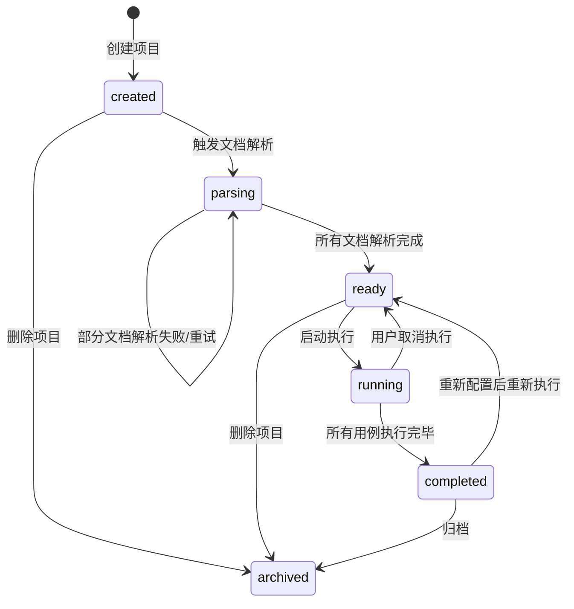
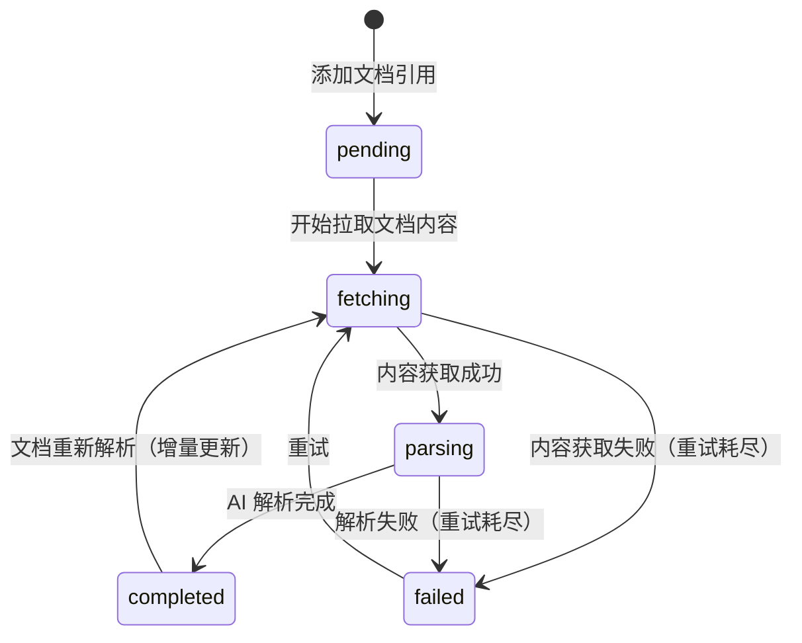
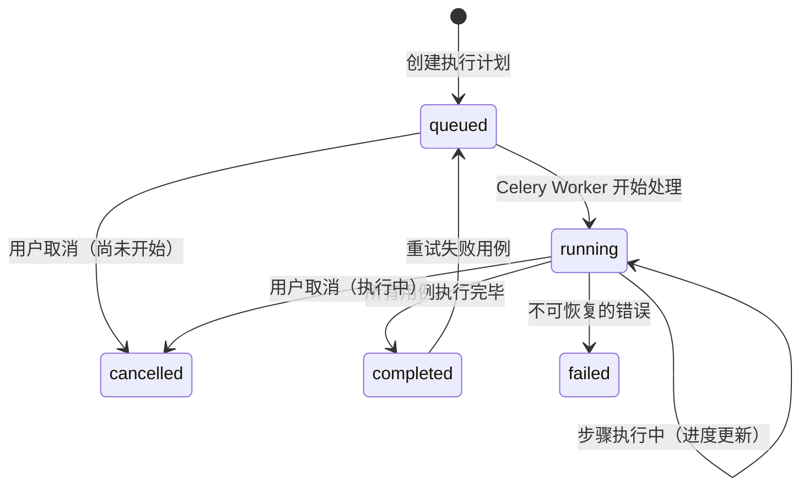

# AutoTest — 详细设计说明书 (Detailed Design / Technical Specification)

> 版本: 1.0 | 最后更新: 2026-05-14 | 状态: 初始草稿
> 基于 SDD (Specification-Driven Development) 方法

---

## 修订历史

| 版本 | 日期 | 修订人 | 修订内容 |
|------|------|--------|----------|
| 1.0 | 2026-05-14 | AutoTest 架构组 | 初始详细设计 |

---

## 目录

1. [引言](#1-引言)
2. [模块 1: 项目管理模块](#2-模块-1-项目管理模块)
3. [模块 2: 文档解析与知识库构建模块](#3-模块-2-文档解析与知识库构建模块)
4. [模块 3: 场景生成模块](#4-模块-3-场景生成模块)
5. [模块 4: 执行调度模块](#5-模块-4-执行调度模块)
6. [模块 5: 平台执行器模块](#6-模块-5-平台执行器模块)
7. [模块 6: 四维校验模块](#7-模块-6-四维校验模块)
8. [模块 7: 综合分析引擎模块](#8-模块-7-综合分析引擎模块)
9. [模块 8: 报告与缺陷管理模块](#9-模块-8-报告与缺陷管理模块)
10. [模块 9: MCP 参考数据接口模块](#10-模块-9-mcp-参考数据接口模块)
11. [模块间协作流程](#11-模块间协作流程)
12. [异常处理规范](#12-异常处理规范)

---

## 1. 引言

### 1.1 文档定位

本文档是 AutoTest 系统的详细设计说明书，基于已确认的需求规格说明书和架构设计文档，对每个模块进行深入的内部设计描述，包括：

- 模块内部组件划分
- 核心接口定义与数据结构
- 关键算法与流程设计
- 模块间交互协议
- 错误处理与边界条件

### 1.2 模块概览

```
┌───────────────────────────────────────────────────────┐
│  1. 项目管理模块        2. 文档解析与知识库构建模块      │
│  (Project Management)   (Document Parse & KB Build)    │
├───────────────────────┬───────────────────────────────┤
│  3. 场景生成模块        4. 执行调度模块                  │
│  (Scenario Generation) (Execution Scheduling)          │
├───────────────────────┴───────────────────────────────┤
│  5. 平台执行器模块                                      │
│  (Web | Android | iOS Executor)                       │
├───────────────────────┬───────────────────────────────┤
│  6. 四维校验模块        7. 综合分析引擎模块               │
│  (UI | Console | API  │ (Cross-Dimension Analysis)     │
│    | Business Verify)  │                               │
├───────────────────────┴───────────────────────────────┤
│  8. 报告与缺陷管理模块   9. MCP 参考数据接口模块          │
│  (Report & Defect)     (MCP Reference Data)           │
└───────────────────────────────────────────────────────┘
```

---

## 2. 模块 1: 项目管理模块

### 2.1 职责

管理测试项目的全生命周期：创建、配置、状态转换、删除。

### 2.2 状态机

```
                    ┌──────────────┐
                    │   created    │
                    └──────┬───────┘
                           │ 文档解析开始
                           ▼
                    ┌──────────────┐
                    │   parsing    │
                    └──────┬───────┘
                           │ 解析完成
                           ▼
                    ┌──────────────┐
                    │    ready     │◄────────┐
                    └──────┬───────┘         │
                           │ 开始执行         │ 执行完成/取消
                           ▼                  │
                    ┌──────────────┐         │
                    │   running    │─────────┘
                    └──────┬───────┘
                           │ 所有执行完成
                           ▼
                    ┌──────────────┐
                    │  completed   │
                    └──────────────┘

状态转换条件:
  created  → parsing: 用户触发文档解析 (POST /documents/parse)
  parsing  → ready:   所有文档解析完成 + 知识库就绪
  ready    → running: 用户触发测试执行 (POST /runs)
  running  → completed: 所有测试用例执行完毕
  running  → ready:     用户取消执行
  任何状态 → archived: 用户归档项目（软删除）
```

### 2.3 核心流程

```
创建项目流程:
  1. 用户提交创建请求 (name, platforms, entries, docs)
  2. 校验参数:
     - name 不能为空
     - platforms 至少一个: web/android/ios
     - entries 每个平台至少一个入口
     - docs URL 格式校验
  3. 生成 project_id
  4. 持久化项目记录
  5. 异步创建知识库（空）
  6. 返回 project_id

删除项目流程:
  1. 检查项目状态（不允许删除 running 状态的项目）
  2. 标记 deleted_at（软删除）
  3. 异步清理关联资源（知识库/场景/执行记录/文件）
```

### 2.4 关键数据结构

```python
@dataclass
class ProjectConfig:
    """项目配置"""
    timeout_ms: int = 30000
    retry_max: int = 3
    retry_delay_s: int = 10
    screenshot_on_error: bool = True
    collect_console_logs: bool = True
    collect_network_requests: bool = True
    max_concurrent_browsers: int = 4

@dataclass
class PlatformEntry:
    """平台入口配置"""
    platform: str                    # web | android | ios
    url: str | None = None           # web 用
    viewport: dict | None = None     # web 用: {"width": 1920, "height": 1080}
    app_package: str | None = None   # android 用
    app_activity: str | None = None  # android 用
    bundle_id: str | None = None     # ios 用
    device_name: str | None = None   # 设备名
```

---

## 3. 模块 2: 文档解析与知识库构建模块

### 3.1 职责

从非结构化产品文档中提取结构化业务规则，构建可工程化消费的知识库。

### 3.2 文档解析 Pipeline

```
┌──────────┐   ┌──────────┐   ┌──────────┐   ┌──────────┐   ┌──────────┐
│ 原始采集  │──▶│ 内容结构化│──▶│ 规则提取  │──▶│ 冲突消解  │──▶│ 知识构建  │
│ Stage 1  │   │ Stage 2  │   │ Stage 3  │   │ Stage 4  │   │ Stage 5  │
└──────────┘   └──────────┘   └──────────┘   └──────────┘   └──────────┘
     │              │              │              │              │
     ▼              ▼              ▼              ▼              ▼
 校验门1:       校验门2:       校验门3:       校验门4:       校验门5:
 内容完整性     结构合理性     规则一致性     冲突裁决       质量评分
```

### 3.3 Stage 1: 原始采集

```python
async def fetch_document_content(doc_ref: DocumentRef) -> DocumentRaw:
    """获取文档原始内容，支持多种源"""
    
    # 1. 缓存检查
    cached = await check_cache(doc_ref.url, doc_ref.version)
    if cached and not await document_has_changed(doc_ref):
        return cached  # 使用缓存，减少拉取
    
    # 2. 根据文档类型选择采集方式
    if doc_ref.url.startswith(('http://', 'https://')):
        if 'feishu.cn' in doc_ref.url:
            return await fetch_feishu_doc(doc_ref.url)
        elif 'confluence' in doc_ref.url:
            return await fetch_confluence_doc(doc_ref.url)
        elif doc_ref.url.endswith(('.md', '.html', '.pdf')):
            return await fetch_url_document(doc_ref.url)
        else:
            return await fetch_generic_web_content(doc_ref.url)
    elif doc_ref.url.startswith('s3://') or doc_ref.url.startswith('oss://'):
        return await fetch_storage_file(doc_ref.url)
    else:
        raise UnsupportedDocumentSourceError(doc_ref.url)
    
    # 3. 重试策略
    # 失败 → 重试 3 次（指数退避: 1s, 3s, 9s）
    # 重试耗尽 → 标记文档为 failed + 错误信息


async def document_has_changed(doc_ref: DocumentRef) -> bool:
    """检测文档是否变更（通过 ETag / Last-Modified / 自定义版本号）"""
    # ... HTTP HEAD 请求检查
```

### 3.4 Stage 2: 内容结构化

```python
def structure_document(raw: DocumentRaw) -> list[Chapter]:
    """将原始文档拆分为结构化章节
    
    算法:
    1. Markdown 标题层级解析 (# ## ### → level 1/2/3)
    2. 语义段落分割（空行分隔 + LlamaIndex 语义分割）
    3. 章节类型分类（使用 LLM 判断章节类型）
    """
    chapters = []
    
    # Step 1: 提取标题层级
    heading_pattern = re.compile(r'^(#{1,6})\s+(.+)$', re.MULTILINE)
    # ... 标题树构建
    
    # Step 2: 将正文分配到最近的标题下
    # ... 内容分块
    
    # Step 3: LLM 判断章节类型
    chapter_types = await ai_classify_chapter_types(chapters)
    
    return structures


async def ai_classify_chapter_types(chapters: list[dict]) -> list[str]:
    """用 LLM 判断每个章节的内容类型"""
    prompt = """判断以下文档章节属于哪种类型（可多选）：
    类型: [流程描述, 角色权限, UI规范, 数据定义, 异常处理, 其他]
    每个章节只选一个主要类型。
    
    章节标题: {heading}
    章节内容前 200 字: {content_preview}
    """
    # ... LLM 调用
```

### 3.5 Stage 3: 规则提取（四策略并行）

```python
async def extract_rules_multi_strategy(
    chapters: list[Chapter],
    strategies: list[str]
) -> ExtractionResult:
    """多策略并行提取规则
    
    strategies: ['general', 'structured', 'multi_round', 'reverse']
    """
    # 并行执行所有策略
    tasks = []
    if 'general' in strategies:
        tasks.append(extract_general(chapters))
    if 'structured' in strategies:
        tasks.append(extract_structured(chapters))
    if 'multi_round' in strategies:
        tasks.append(extract_multi_round(chapters))
    if 'reverse' in strategies:
        tasks.append(extract_reverse(chapters))
    
    results = await asyncio.gather(*tasks, return_exceptions=True)
    
    # 合并所有策略结果
    return await merge_strategy_results(results)


async def extract_general(chapters: list[Chapter]) -> list[RawRule]:
    """策略A: 通用提取 Prompt"""
    # 角色: 业务分析师 - 关注流程
    analyst_result = await ai_call(
        system=ANALYST_SYSTEM_PROMPT,
        prompt=ANALYST_EXTRACT_PROMPT.format(chapter=chapter),
        response_model=AnalystExtraction
    )
    
    # 角色: 测试架构师 - 关注规则
    architect_result = await ai_call(
        system=ARCHITECT_SYSTEM_PROMPT,
        prompt=ARCHITECT_EXTRACT_PROMPT.format(chapter=chapter),
        response_model=ArchitectExtraction
    )
    
    # 角色: UI 规范师 - 关注界面
    ui_result = await ai_call(...)
    
    return merge_multi_role_results([analyst_result, architect_result, ui_result])


async def extract_structured(chapters: list[Chapter]) -> list[RawRule]:
    """策略B: Schema-guided 提取"""
    # 使用严格的 JSON Schema 约束输出
    rules = await ai_call(
        prompt=f"从以下文档中提取规则，严格按照 Schema 输出",
        response_model=RulesSchema,  # Pydantic 模型
    )
    return rules


async def extract_multi_round(chapters: list[Chapter]) -> list[RawRule]:
    """策略C: 多轮追问"""
    # 第一轮: 初步提取
    initial_rules = await ai_call(...)
    
    # 第二轮: 追问细节
    follow_up_questions = generate_follow_up_questions(initial_rules)
    deep_rules = await ai_call(
        prompt=f"针对以下问题补充规则: {follow_up_questions}"
    )
    
    return merge_rules(initial_rules, deep_rules)


async def extract_reverse(chapters: list[Chapter]) -> list[RawRule]:
    """策略D: 反向校验"""
    # 不提取，而是问"漏掉了什么"
    missed = await ai_call(
        prompt="从以下文档中，有哪些业务规则可能被我漏掉了？列出可能遗漏的规则"
    )
    return missed


async def merge_strategy_results(all_results: list) -> ExtractionResult:
    """合并多策略结果
    
    合并逻辑:
    - 4 策略一致 → 高置信度 (≥ 0.9)
    - 3/4 策略一致 → 中置信度 (0.7-0.9)
    - 2/4 策略一致 → 低置信度 (0.5-0.7)
    - 1/4 策略一致 → 候选 (标记待确认)
    """
    # 1. 语义去重（embedding 相似度 ≥ 0.85）
    # 2. 置信度计算
    # 3. 冲突检测
    # 4. 返回合并结果
```

### 3.6 Stage 4: 冲突检测与消解

```python
async def detect_and_resolve_conflicts(rules: list[RawRule]) -> ConflictResolution:
    """冲突检测 Pipeline"""
    
    # Step 1: 语义去重
    unique_rules = await semantic_dedup(rules)
    
    # Step 2: 层级关系检测
    hierarchy_rules = await detect_hierarchy_conflicts(unique_rules)
    
    # Step 3: 矛盾检测
    contradictions = await detect_contradictions(
        [r for r in unique_rules if r.id not in hierarchy_rules]
    )
    
    # Step 4: 自动消解策略
    resolved = []
    pending = []
    for conflict in contradictions:
        if conflict.type == "synonym":
            resolved.append(merge_synonym_rules(conflict))
        elif conflict.type == "hierarchy":
            resolved.append(resolve_hierarchy(conflict))
        elif conflict.type == "contradiction":
            # 无法自动裁决，需要人工
            pending.append(conflict)
    
    return ConflictResolution(
        resolved=resolved,
        pending=pending
    )


async def semantic_dedup(rules: list[RawRule]) -> list[RawRule]:
    """语义去重: 使用 embedding 相似度"""
    # 1. 为所有规则生成 embedding
    embeddings = await generate_embeddings([r.content for r in rules])
    
    # 2. 两两计算余弦相似度
    # 3. 相似度 ≥ 0.85 → 视为同义规则
    # 4. 保留置信度高的，合并来源信息
```

### 3.7 Stage 5: 业务链构建

```python
async def build_business_chains(rules: list[BusinessRule]) -> list[BusinessChain]:
    """从业务规则构建完整的业务链 DAG
    
    输入: 孤立规则 -> 输出: 有向无环图（含回环检测）
    """
    
    # Step 1: 提取规则中的页面/操作引用
    pages = await extract_page_references(rules)
    
    # Step 2: 构建页面跳转图
    graph = nx.DiGraph()
    for page in pages:
        graph.add_node(page.name, page=page)
        for transition in page.transitions:
            graph.add_edge(page.name, transition.target_page, 
                         action=transition.action)
    
    # Step 3: 回环检测
    # 订单→支付→订单详情 是合理回环，不是错误
    cycles = list(nx.simple_cycles(graph))
    valid_cycles = filter_valid_cycles(cycles)
    
    # Step 4: 断头节点检测（只有入度没有出度）
    dead_ends = [n for n in graph.nodes() if graph.out_degree(n) == 0]
    
    # Step 5: 拓扑排序 → 业务链
    chains = []
    for start_node in find_start_nodes(graph):
        for path in nx.all_simple_paths(graph, start_node, dead_ends):
            chains.append(BusinessChain(
                steps=[build_step_from_path(graph, path)]
            ))
    
    return chains
```

### 3.8 知识库版本化

```python
async def create_kb_version(kb: KnowledgeBase, changes: KbChanges) -> KnowledgeBase:
    """创建新版本知识库"""
    new_kb = KnowledgeBase(
        project_id=kb.project_id,
        version=kb.version + 1,
        quality_score=kb.quality_score,  # 暂用旧分数，后台重新计算
        human_reviewed=False,
        changelog=[
            *kb.changelog,
            {
                "version": kb.version + 1,
                "change": f"文档更新: {len(changes.added)} 新增, "
                         f"{len(changes.modified)} 修改, {len(changes.removed)} 删除",
                "rules_count": len(changes.added) + len(kb.confirmed_rules) - len(changes.removed)
            }
        ]
    )
    return new_kb


async def incremental_update(project_id: str) -> KnowledgeBase:
    """增量更新：只处理变更的文档"""
    old_kb = await knowledge_repo.get_latest(project_id)
    
    # 检测哪些文档变更了
    changed_docs = [
        doc for doc in old_kb.source_documents
        if await document_has_changed(doc)
    ]
    
    if not changed_docs:
        return old_kb  # 无变更
    
    # 只重新解析变更的文档
    new_rules = []
    for doc in changed_docs:
        extract = await parse_single_document(doc)
        new_rules.extend(extract.rules)
    
    # 对比新旧规则（变化检测）
    old_rules = old_kb.get_all_rules()
    added, removed, modified = detect_rule_changes(new_rules, old_rules)
    
    # 只对变更部分执行冲突检测
    conflicts = await detect_conflicts(added + modified)
    
    # 构建新版本
    return await create_kb_version(old_kb, KbChanges(
        added=added, removed=removed, modified=modified, conflicts=conflicts
    ))
```

---

## 4. 模块 3: 场景生成模块

### 4.1 职责

从知识库自动生成可执行的测试场景矩阵。

### 4.2 生成算法

```python
async def generate_scenarios(kb: KnowledgeBase, platforms: list[str]) -> list[TestScenario]:
    """从知识库生成测试场景
    
    生成策略:
    - 每个业务线 × 每个角色 → 一组场景
    - 每个场景包含: 正向 + 边界 + 异常 + 权限 四种类型
    - 每种类型包含多个测试用例
    """
    scenarios = []
    
    # Step 1: 遍历业务线
    for business_line in kb.business_lines:
        # Step 2: 遍历角色
        roles = get_roles_for_business_line(kb, business_line.id)
        for role in roles:
            # Step 3: 生成四种类型的场景
            for scene_type in ["positive", "boundary", "abnormal", "permission"]:
                if scene_type == "permission" and role == "anonymous":
                    continue  # 匿名用户不生成权限场景
                
                scenario = await generate_single_scenario(
                    kb, business_line, role, scene_type, platforms
                )
                if scenario and scenario.cases:
                    scenarios.append(scenario)
    
    return scenarios


async def generate_single_scenario(
    kb: KnowledgeBase,
    business_line: BusinessLine,
    role: str,
    scene_type: str,
    platforms: list[str]
) -> TestScenario | None:
    """生成单个场景"""
    
    # 1. 获取场景相关的规则
    relevant_rules = get_rules_for_scenario(kb, business_line, role, scene_type)
    if not relevant_rules:
        return None
    
    # 2. 生成场景描述
    scenario_desc = await ai_generate_scenario_desc(
        business_line, role, scene_type, relevant_rules
    )
    
    # 3. 生成测试用例
    cases = []
    for i in range(get_case_count_for_type(scene_type)):
        test_case = await ai_generate_test_case(
            business_line, role, scene_type, relevant_rules, i
        )
        
        # 4. 校验用例质量
        if await validate_test_case(test_case):
            cases.append(test_case)
    
    if not cases:
        return None
    
    return TestScenario(
        project_id=kb.project_id,
        business_line=business_line.name,
        name=scenario_desc.name,
        type=scene_type,
        role=role,
        cases=cases,
        coverage=calculate_coverage(relevant_rules, cases)
    )


async def validate_test_case(test_case: TestCase) -> bool:
    """校验测试用例质量
    
    校验项:
    1. 每一步都是可执行的（非模糊描述）
    2. 每一步都有明确预期
    3. 预期结果包含校验维度
    4. 没有重复步骤
    """
    for step in test_case.steps:
        if not is_executable(step.action):
            return False
        if not has_clear_expectation(step):
            return False
    return True
```

### 4.3 场景覆盖度评分

```python
def measure_coverage(
    kb: KnowledgeBase, scenarios: list[TestScenario]
) -> CoverageReport:
    """量化场景覆盖度（S/A/B/C/D 评级）"""
    
    # 规则覆盖率
    all_rules = set(kb.get_all_rules())
    covered_rules = set()
    for scenario in scenarios:
        for case in scenario.cases:
            for step in case.steps:
                for ref in step.rule_refs:
                    covered_rules.add(ref.rule_id)
    
    rule_coverage = len(covered_rules) / len(all_rules) if all_rules else 0
    
    # 页面覆盖率
    all_pages = kb.get_all_pages()
    covered_pages = set()
    for scenario in scenarios:
        for case in scenario.cases:
            for step in case.steps:
                if step.page_ref:
                    covered_pages.add(step.page_ref)
    page_coverage = len(covered_pages) / len(all_pages) if all_pages else 0
    
    # 角色覆盖率
    all_roles = kb.roles
    covered_roles = set(s.role for s in scenarios)
    role_coverage = len(covered_roles) / len(all_roles) if all_roles else 0
    
    # 路径类型分布
    type_dist = Counter(s.type for s in scenarios)
    
    # 综合评级
    overall = calculate_grade(rule_coverage, page_coverage, role_coverage)
    
    return CoverageReport(
        grade=overall,
        rule_coverage=rule_coverage,
        page_coverage=page_coverage,
        role_coverage=role_coverage,
        type_distribution=dict(type_dist),
        gaps=find_gaps(kb, covered_rules, covered_pages, covered_roles)
    )
```

---

## 5. 模块 4: 执行调度模块

### 5.1 职责

编排测试执行计划，管理任务队列，处理并发和重试。

### 5.2 执行流程

```python
async def execute_run(run_id: str) -> None:
    """执行测试计划的主流程"""
    run = await run_repo.get_by_id(run_id)
    if not run:
        raise RunNotFoundError(run_id)
    
    # 1. 更新状态为 running
    await run_repo.update_status(run_id, "running")
    
    # 2. 获取运行用例
    run_cases = await run_repo.get_run_cases(run_id)
    
    # 3. 按平台分组
    platform_cases = group_by_platform(run_cases)
    
    # 4. 为每个平台创建 Celery 任务组
    celery_group = []
    for platform, cases in platform_cases.items():
        celery_group.append(
            execute_platform_cases.s(
                run_id=run_id,
                platform=platform,
                case_ids=[c.case_id for c in cases]
            )
        )
    
    # 5. 并行执行所有平台
    # 每个平台内部串行执行用例
    result = await celery.group(celery_group).apply_async()
    
    # 6. 等待所有完成
    # (Celery 回调自动更新进度)


@celery.task(bind=True, max_retries=3)
async def execute_platform_cases(
    self,
    run_id: str,
    platform: str,
    case_ids: list[str]
) -> PlatformResult:
    """执行单个平台的所有用例"""
    results = []
    
    for case_id in case_ids:
        # 更新用例状态为 running
        await run_repo.update_case_status(run_id, case_id, "running")
        
        try:
            # 执行用例（串行步骤执行）
            step_results = await execute_test_case(
                run_id, case_id, platform
            )
            
            # 判断用例是否通过
            case_status = determine_case_status(step_results)
            await run_repo.update_case_status(
                run_id, case_id, case_status
            )
            
            # 如果发现缺陷，立即分析
            if case_status == "failed":
                await analyze_defects(run_id, case_id, step_results)
            
            results.append(CaseResult(case_id=case_id, status=case_status))
            
        except Exception as e:
            # 重试逻辑
            if self.request.retries < self.max_retries:
                raise self.retry(exc=e, countdown=10 * (self.request.retries + 1))
            else:
                await run_repo.update_case_status(run_id, case_id, "failed")
                results.append(CaseResult(case_id=case_id, status="failed", error=str(e)))
        
        # 推送进度
        await push_run_progress(run_id)
    
    return PlatformResult(platform=platform, results=results)


async def execute_test_case(
    run_id: str,
    case_id: str,
    platform: str
) -> list[StepExecutionRecord]:
    """执行单个测试用例的所有步骤"""
    case = await scenario_repo.get_case(case_id)
    executor = await get_executor(platform, run_id=run_id)
    
    step_records = []
    for step in case.steps:
        # 执行步骤
        step_result = await executor.execute_step(step)
        
        # 采集四维数据
        step_result = await collect_verification_data(executor, step_result)
        
        # 综合分析（如有异常）
        if has_anomaly(step_result):
            step_result = await cross_dimension_analysis(step_result)
        
        step_records.append(step_result)
        
        # 如果步骤失败，根据策略决定是否继续
        if step_result.status == "failed" and not case.continue_on_failure:
            break
    
    return step_records
```

### 5.3 并发控制

```python
class ConcurrencyManager:
    """执行器并发管理器（控制同时运行的浏览器/设备数）"""
    
    def __init__(self):
        self._semaphores: dict[str, asyncio.Semaphore] = {}
        # 默认并发限制
        self._default_limits = {
            "web": 4,       # 默认 4 个并发浏览器
            "android": 2,   # 默认 2 台并发设备
            "ios": 2,       # 默认 2 台并发设备
        }
    
    async def acquire(self, platform: str, run_id: str) -> None:
        """获取执行许可"""
        sem = self._get_or_create_semaphore(platform, run_id)
        await sem.acquire()
    
    def release(self, platform: str, run_id: str) -> None:
        """释放执行许可"""
        sem = self._get_or_create_semaphore(platform, run_id)
        sem.release()
    
    def _get_or_create_semaphore(
        self, platform: str, run_id: str
    ) -> asyncio.Semaphore:
        limit = self._default_limits.get(platform, 2)
        return asyncio.Semaphore(limit)
```

---

## 6. 模块 5: 平台执行器模块

### 6.1 职责

在各平台上执行具体的测试步骤，采集所有维度的原始数据。

### 6.2 统一执行器接口

```python
class PlatformExecutor(ABC):
    """平台执行器抽象接口"""
    
    @abstractmethod
    async def initialize(self, entry: PlatformEntry) -> None:
        """初始化执行器（启动浏览器/连接设备）"""
        pass
    
    @abstractmethod
    async def execute_step(self, step: TestStep) -> StepExecutionRecord:
        """执行单个测试步骤"""
        pass
    
    @abstractmethod
    async def get_page_state(self) -> PageState:
        """获取当前页面状态"""
        pass
    
    @abstractmethod
    async def get_console_logs(self) -> ConsoleSnapshot:
        """获取控制台日志"""
        pass
    
    @abstractmethod
    async def get_network_requests(self) -> NetworkSnapshot:
        """获取网络请求记录"""
        pass
    
    @abstractmethod
    async def take_screenshot(self) -> str:
        """截图（返回 base64）"""
        pass
    
    @abstractmethod
    async def cleanup(self) -> None:
        """清理资源"""
        pass
```

### 6.3 Web 执行器（Midscene.web + Playwright）

```python
class WebExecutor(PlatformExecutor):
    """Web 平台执行器"""
    
    def __init__(self, config: WebConfig):
        self.config = config
        self.browser: playwright.Browser | None = None
        self.context: playwright.BrowserContext | None = None
        self.page: playwright.Page | None = None
        self.network_requests: list[NetworkEntry] = []
    
    async def initialize(self, entry: PlatformEntry) -> None:
        """启动浏览器"""
        self.browser = await playwright.chromium.launch(
            headless=self.config.headless,
            args=["--no-sandbox"]
        )
        self.context = await self.browser.new_context(
            viewport=entry.viewport or {"width": 1920, "height": 1080}
        )
        self.page = await self.context.new_page()
        
        # 拦截网络请求
        await self.page.route("**/*", self._capture_request)
        
        # 采集控制台日志
        self.page.on("console", self._capture_console)
        
        # 导航到目标 URL
        await self.page.goto(entry.url, wait_until="networkidle")
    
    async def execute_step(self, step: TestStep) -> StepExecutionRecord:
        """执行步骤
        使用 Midscene.js 的 AI 视觉定位能力：
        - 通过自然语言描述定位 UI 元素
        - AI 模型根据截图识别元素位置
        - 执行点击/输入等操作
        """
        # 操作前截图
        screenshot_before = await self.take_screenshot()
        
        # 清空网络请求缓存
        self._step_requests = []
        
        start_time = time.time()
        
        try:
            # 调用 Midscene Agent 执行步骤
            midscene_result = await self._midscene_agent.execute(
                action=step.action,
                target=step.target,
                value=step.get("value")
            )
            
            # 等待页面稳定
            await self.page.wait_for_timeout(1000)
            
            duration = int((time.time() - start_time) * 1000)
            
            # 操作后截图
            screenshot_after = await self.take_screenshot()
            
            # 获取页面状态
            page_state = await self.get_page_state()
            
            return StepExecutionRecord(
                step_index=step.index,
                action=step.action,
                platform="web",
                status="passed" if midscene_result.success else "failed",
                duration_ms=duration,
                screenshots={
                    "before": screenshot_before,
                    "after": screenshot_after,
                },
                console_snapshot=self._get_step_console_logs(),
                network_snapshot=NetworkSnapshot(
                    requests=self._step_requests,
                    failed=[r for r in self._step_requests if r.response.status >= 400]
                ),
                page_state=page_state,
            )
            
        except Exception as e:
            error_screenshot = await self.take_screenshot()
            return StepExecutionRecord(
                step_index=step.index,
                action=step.action,
                platform="web",
                status="failed",
                duration_ms=int((time.time() - start_time) * 1000),
                screenshots={"error": error_screenshot},
                error=str(e)
            )
    
    async def _midscene_agent_execute(
        self, action: str, target: str, value: str | None
    ) -> MidsceneResult:
        """通过 Midscene.js Agent 执行 AI 视觉操作
        
        Midscene Agent 的工作方式:
        1. 将自然语言操作指令发送给 Midscene
        2. Midscene 对当前页面截图
        3. AI 模型分析截图，识别目标元素
        4. 返回元素的坐标或 DOM 选择器
        5. Midscene 执行实际点击/输入操作
        """
        # 通过 HTTP API 调用 Midscene Agent 服务
        response = await self.http_client.post(
            f"{self.midscene_url}/agent/execute",
            json={
                "action": action,
                "target": target,
                "value": value,
                "screenshot": "latest"  # 使用当前页面截图
            }
        )
        return MidsceneResult(**response.json())
    
    # ═══════════════════════════════════════════════════════════
    # AI 视觉定位降级策略
    # ═══════════════════════════════════════════════════════════
    # 
    # Midscene.js AI 视觉定位是首选方式。当 AI 定位失败时，
    # 按以下层级降级（每一级都比上一级更可靠但更脆弱）:
    #
    #   Level 0: AI Visual (首选)
    #     方式: Midscene.js 截图+AI识别 → 坐标
    #     优点: 改UI零影响
    #     缺点: 复杂UI偶发不准
    #     适用: 所有场景
    #
    #   Level 1: DOM Text Match (轻量降级)
    #     方式: 页面 DOM 中搜索元素的 visible text → 坐标
    #     优点: 不需要 AI，速度快 (~200ms)
    #     缺点: 依赖 DOM 文本，文本变化会导致失败
    #     触发: AI 定位置信度 < 0.6
    #
    #   Level 2: XPath/CSS Selector (精确降级)
    #     方式: 预配置的 XPath/CSS 选择器 → Playwright locator
    #     优点: 确定性匹配
    #     缺点: 改 UI/改 class → 失效
    #     触发: DOM Text Match 失败
    #
    #   Level 3: Coordinate Click (兜底)
    #     方式: 已知固定坐标点击
    #     优点: 100% 确定
    #     缺点: 布局变化 → 点错位置
    #     触发: 仅用于"我知道这个按钮就在这个位置"的场景
    #
    # 降级链实现:
    #
    # execute_step()
    #   │
    #   ├── Level 0: AI Midscene
    #   │   ├── 成功 → 返回结果
    #   │   └── 失败或置信度 < 0.6
    #   │       └── ▶ Level 1: DOM Text Match
    #   │           ├── 成功 → 返回结果
    #   │           └── 失败
    #   │               └── ▶ Level 2: XPath (如果配置了)
    #   │                   ├── 成功 → 返回结果
    #   │                   └── 失败 → 标记 failed + 保留 AI 定位错误信息
    #   │
    #   └── 所有级别都失败 → step.status = "failed"
    #       保留各级失败原因（用于调试和改进）
    # ═══════════════════════════════════════════════════════════

    async def _execute_with_fallback(self, step: TestStep) -> StepResult:
        """带降级链的步骤执行"""
        fallback_log = []
        
        # Level 0: AI Visual
        try:
            result = await self._midscene_agent_execute(
                step.action, step.target, step.get("value")
            )
            if result.success and result.confidence >= 0.6:
                return StepResult(status="passed", method="ai_visual", 
                                confidence=result.confidence)
            fallback_log.append({"level": 0, "method": "ai_visual", 
                                "reason": f"confidence={result.confidence}"})
        except Exception as e:
            fallback_log.append({"level": 0, "method": "ai_visual", "error": str(e)})
        
        # Level 1: DOM Text Match
        try:
            dom_result = await self._dom_text_match(step.target)
            if dom_result.found:
                return StepResult(status="passed", method="dom_text",
                                confidence=0.8, fallback_log=fallback_log)
            fallback_log.append({"level": 1, "method": "dom_text", 
                                "reason": "text not found in DOM"})
        except Exception as e:
            fallback_log.append({"level": 1, "method": "dom_text", "error": str(e)})
        
        # Level 2: XPath (if configured)
        if step.xpath:
            try:
                await self.page.locator(step.xpath).click()
                return StepResult(status="passed", method="xpath",
                                confidence=0.95, fallback_log=fallback_log)
            except Exception as e:
                fallback_log.append({"level": 2, "method": "xpath", "error": str(e)})
        
        # All levels failed
        return StepResult(status="failed", method="all_fallback_exhausted",
                         fallback_log=fallback_log)
    
    async def _dom_text_match(self, target_text: str) -> DomMatchResult:
        """DOM 文本匹配定位——当 AI 视觉定位失败时的轻量降级"""
        # 在页面 DOM 中搜索包含目标文本的元素
        # 使用 Playwright 的 get_by_text / locator
        try:
            # 1. 精确文本匹配
            locator = self.page.get_by_text(target_text, exact=True)
            if await locator.count() > 0:
                await locator.first.click()
                return DomMatchResult(found=True, method="exact_text")
            
            # 2. 模糊文本匹配（包含）
            locator = self.page.get_by_text(target_text, exact=False)
            if await locator.count() > 0:
                await locator.first.click()
                return DomMatchResult(found=True, method="fuzzy_text")
            
            # 3. 按 role 匹配（按钮、链接等）
            locator = self.page.get_by_role("button", name=target_text)
            if await locator.count() > 0:
                await locator.first.click()
                return DomMatchResult(found=True, method="role_button")
            
            return DomMatchResult(found=False)
        except Exception:
            return DomMatchResult(found=False)

    # ═══════════════════════════════════════════════════════════
    # Mock Execution Mode（开发/测试模式）
    # ═══════════════════════════════════════════════════════════
    # 
    # 当 EXECUTOR_MODE=mock 时，执行器不启动真实浏览器，
    # 而是返回模拟的 StepExecutionRecord。
    # 用于：
    #   1. 开发调试（不需要浏览器环境）
    #   2. CI 环境（不需要 Playwright 依赖）
    #   3. 集成测试（验证流程而非页面）
    #
    # Mock 执行器实现:
    
    async def mock_execute_step(self, step: TestStep) -> StepExecutionRecord:
        """Mock 模式执行——返回模拟结果，不启动浏览器"""
        return StepExecutionRecord(
            step_index=step.index,
            action=step.action,
            platform="web",
            status="passed" if step.index < 5 else "uncertain",  # 前 5 步通过
            duration_ms=random.randint(100, 500),
            screenshots={"mock": "data:image/png;base64,iVBOR..."},  # 1x1 像素占位
            console_snapshot=ConsoleSnapshot(errors=[], warnings=[]),
            network_snapshot=NetworkSnapshot(requests=[], failed=[]),
            page_state=PageState(
                current_url="https://example.com/mock",
                visible_text_elements=["Mock 页面", "测试数据"],
                active_alerts=[]
            ),
            verifications=Verifications(
                ui=VerificationResult(status="pass", dimension="ui", confidence=0.9),
                console=VerificationResult(status="pass", dimension="console", confidence=0.95),
                api=VerificationResult(status="pass", dimension="api", confidence=0.9),
                business=VerificationResult(status="uncertain", dimension="business", confidence=0.5),
            )
        )

    async def get_console_logs(self) -> ConsoleSnapshot:
        """获取当前控制台日志"""
        return ConsoleSnapshot(
            errors=[e for e in self._console_logs if e.level == "error"],
            warnings=[e for e in self._console_logs if e.level == "warning"],
        )
    
    async def take_screenshot(self) -> str:
        """截图（返回 base64）"""
        if self.page:
            screenshot_bytes = await self.page.screenshot(full_page=True)
            return base64.b64encode(screenshot_bytes).decode()
        return ""
```

### 6.4 执行器通信协议

```yaml
Python 服务端 → Node.js 执行器通信:

1. 创建执行器任务:
   POST /executor/run
   {
     "run_id": "run_001",
     "cases": [...],
     "entry": {"url": "https://...", "viewport": {...}}
   }
   → {"task_id": "exec_task_001", "status": "accepted"}

2. 获取执行进度:
   GET /executor/runs/exec_task_001/progress
   → {"status": "running", "progress": 0.45, ...}

3. 执行器回调（WebSocket）:
   连接: ws://executor:port/ws/run_001
   消息: {"type": "step_completed", "data": {...}}

4. 获取步骤数据:
   GET /executor/runs/exec_task_001/steps/3
   → StepExecutionRecord (JSON)

5. 取消执行:
   POST /executor/runs/exec_task_001/cancel
```

---

## 7. 模块 6: 四维校验模块

### 7.1 职责

对每个执行步骤进行四个维度的独立校验。

### 7.2 校验流程

```python
async def collect_verification_data(
    executor: PlatformExecutor,
    step_result: StepExecutionRecord
) -> StepExecutionRecord:
    """对执行步骤进行四维数据采集"""
    
    # 四个维度并行采集
    ui_task = verify_ui_dimension(step_result)
    console_task = verify_console_dimension(step_result)
    api_task = verify_api_dimension(step_result)
    biz_task = verify_business_dimension(step_result, executor)
    
    ui_result, console_result, api_result, biz_result = await asyncio.gather(
        ui_task, console_task, api_task, biz_task,
        return_exceptions=True
    )
    
    step_result.verifications = Verifications(
        ui=ui_result if not isinstance(ui_result, Exception) else VerificationResult(status="error"),
        console=console_result if not isinstance(console_result, Exception) else VerificationResult(status="error"),
        api=api_result if not isinstance(api_result, Exception) else VerificationResult(status="error"),
        business=biz_result if not isinstance(biz_result, Exception) else VerificationResult(status="error"),
    )
    
    return step_result
```

### 7.3 UI 校验

```python
async def verify_ui_dimension(step: StepExecutionRecord) -> VerificationResult:
    """UI 渲染校验
    
    校验内容:
    - 关键文案是否可见
    - 是否有错误提示
    - 页面是否正常渲染（非空白/非加载中）
    """
    page_state = step.page_state
    
    issues = []
    
    # 1. 检测错误提示
    error_keywords = ["系统错误", "网络错误", "服务器错误", "404", "500",
                      "error", "failed", "出错了", "请稍后重试"]
    for alert in page_state.active_alerts:
        for keyword in error_keywords:
            if keyword.lower() in alert.lower():
                issues.append(Issue(
                    dimension="ui",
                    severity="error",
                    detail=f"页面包含错误提示: {alert}"
                ))
                break
    
    # 2. 检测关键组件缺失
    # 通常通过对比 UI 标准库中的预期组件
    # ...
    
    # 3. 置信度评估
    confidence = 0.95  # default
    
    status = "pass"
    if issues:
        status = "failed" if any(i.severity == "error" for i in issues) else "uncertain"
    
    return VerificationResult(
        status=status,
        dimension="ui",
        issues=issues,
        confidence=confidence
    )
```

### 7.4 控制台校验

```python
async def verify_console_dimension(step: StepExecutionRecord) -> VerificationResult:
    """控制台日志校验"""
    logs = step.console_snapshot
    
    issues = []
    
    # 错误级别日志
    for error in logs.errors:
        issues.append(Issue(
            dimension="console",
            severity="error",
            detail=f"JS Error: {error.message}",
            source=error.source,
            stack=error.stack
        ))
    
    # 警告级别日志
    for warning in logs.warnings:
        issues.append(Issue(
            dimension="console",
            severity="warning",
            detail=f"Console Warning: {warning.message}",
            source=warning.source
        ))
    
    status = "pass"
    if logs.errors:
        status = "failed"
    elif logs.warnings:
        status = "uncertain"
    
    return VerificationResult(
        status=status,
        dimension="console",
        issues=issues,
        confidence=0.98  # 控制台日志准确率高
    )
```

### 7.5 API 校验

```python
async def verify_api_dimension(step: StepExecutionRecord) -> VerificationResult:
    """API 请求/响应校验"""
    network = step.network_snapshot
    
    issues = []
    
    for req in network.requests:
        status = req.response.status if req.response else 0
        
        # 4xx/5xx 错误
        if 400 <= status < 600:
            severity = "error" if status >= 500 else "warning"
            issues.append(Issue(
                dimension="api",
                severity=severity,
                detail=f"API {req.method} {req.url} → {status}",
                request=req.request,
                response=req.response
            ))
        
        # 超时检测
        if req.timing and req.timing.duration_ms > 5000:
            issues.append(Issue(
                dimension="api",
                severity="warning",
                detail=f"API 响应过慢: {req.url} → {req.timing.duration_ms}ms"
            ))
    
    status = "pass"
    if any(i.severity == "error" for i in issues):
        status = "failed"
    elif issues:
        status = "uncertain"
    
    return VerificationResult(
        status=status,
        dimension="api",
        issues=issues,
        confidence=0.95
    )
```

### 7.6 业务校验

```python
async def verify_business_dimension(
    step: StepExecutionRecord,
    executor: PlatformExecutor
) -> VerificationResult:
    """业务结果校验
    
    校验内容:
    - URL 是否符合预期
    - 页面标题/状态是否符合预期
    - 关键业务元素是否出现
    """
    page_state = step.page_state
    expected = step.get("expected", {})
    
    if not expected:
        return VerificationResult(
            status="uncertain",
            dimension="business",
            issues=[],
            confidence=0.5,
            detail="没有定义预期结果，跳过业务校验"
        )
    
    issues = []
    
    # 1. URL 校验
    if expected.get("url_contains"):
        if expected["url_contains"] not in page_state.current_url:
            issues.append(Issue(
                dimension="business",
                severity="error",
                detail=f"URL 不匹配: 预期包含 '{expected['url_contains']}', "
                       f"实际: {page_state.current_url}"
            ))
    
    # 2. 可见文本校验
    if expected.get("visible_text"):
        if expected["visible_text"] not in page_state.visible_text_elements:
            issues.append(Issue(
                dimension="business",
                severity="error",
                detail=f"未找到预期文本: '{expected['visible_text']}'"
            ))
    
    # 3. LLM 综合判断（可选，低置信度场景）
    if not issues and expected.get("llm_check"):
        llm_result = await ai_verify_business_result(
            page_state=page_state,
            expected=expected
        )
        if not llm_result.passed:
            issues.append(Issue(
                dimension="business",
                severity="warning",
                detail=llm_result.reason,
                confidence=llm_result.confidence
            ))
    
    status = "pass" if not issues else (
        "failed" if any(i.severity == "error" for i in issues) else "uncertain"
    )
    
    return VerificationResult(
        status=status,
        dimension="business",
        issues=issues,
        confidence=0.85 if issues else 0.9
    )
```

---

## 8. 模块 7: 综合分析引擎模块

> 这是 AutoTest 最核心的模块。详细设计见需求文档第七章。
> 本节补充实现层面的关键设计。

### 8.1 引擎架构

```python
class CrossDimensionAnalyzer:
    """综合分析引擎"""
    
    def __init__(self, config: AnalysisConfig):
        self.config = config
        self.rule_engine = CausalRuleEngine()   # 静态规则引擎
        self.llm_judge = LLMCausalJudge()       # LLM 因果判断
    
    async def analyze(self, step_data: StepExecutionData) -> CrossDimensionReport:
        """综合分析主入口"""
        
        # 1. 时间对齐
        timeline = self._align_timeline(step_data)
        
        # 2. 异常检测
        anomalies = self._detect_anomalies(step_data)
        
        # 无异常 → 直接通过
        if not anomalies:
            return CrossDimensionReport(status="pass")
        
        # 3. 因果发现
        chains = await self._discover_causal_chains(timeline, anomalies)
        
        # 4. 构建综合论断
        synthesis = self._build_synthesis(chains, anomalies)
        
        return CrossDimensionReport(
            status="fail",
            anomalies=anomalies,
            synthesis=synthesis
        )
    
    def _align_timeline(self, step_data: StepExecutionData) -> Timeline:
        """将各维度数据按时间戳对齐"""
        timeline = Timeline()
        
        # 控制台日志
        for entry in step_data.console_logs.errors:
            timeline.add_event(entry.timestamp, "console.error", entry)
        for entry in step_data.console_logs.warnings:
            timeline.add_event(entry.timestamp, "console.warning", entry)
        
        # 网络请求
        for req in step_data.network_snapshot.requests:
            if req.timing:
                timeline.add_event(req.timing.start, "api.start", req)
                timeline.add_event(req.timing.end, "api.end", req)
        
        # 截图时间
        timeline.add_event(step_data.timestamp, "screenshot", step_data.screenshots.get("after"))
        
        return timeline
    
    async def _discover_causal_chains(
        self,
        timeline: Timeline,
        anomalies: list[Anomaly]
    ) -> list[EvidenceChain]:
        """因果发现"""
        
        # 先按时间排序
        sorted_events = sorted(
            anomalies, key=lambda a: a.timestamp
        )
        
        chains = []
        used_events = set()
        
        for i, event_a in enumerate(sorted_events):
            if event_a.id in used_events:
                continue
            
            chain = EvidenceChain(root_trigger=event_a)
            
            for j, event_b in enumerate(sorted_events):
                if j <= i or event_b.id in used_events:
                    continue
                
                # 先尝试规则引擎
                if self.rule_engine.is_causally_related(event_a, event_b):
                    chain.add_propagation(event_a, event_b)
                    used_events.add(event_b.id)
                # 规则引擎无法判断 → LLM 兜底
                elif self.config.use_llm_fallback:
                    if await self.llm_judge.judge(event_a, event_b):
                        chain.add_propagation(event_a, event_b, source="llm")
                        used_events.add(event_b.id)
            
            if chain.has_propagations:
                chains.append(chain)
                used_events.add(event_a.id)
        
        return chains
```

### 8.2 规则引擎

```python
class CausalRuleEngine:
    """已知因果关系的规则引擎
    
    处理 80% 的常见因果模式，无需 LLM 介入
    """
    
    def __init__(self):
        # 规则: (source_type, target_type) → check_function
        self._rules = {
            ("api_error", "console_error"): self._check_api_to_console,
            ("api_error", "ui_broken"): self._check_api_to_ui,
            ("console_error", "ui_broken"): self._check_console_to_ui,
            ("api_error", "api_error"): self._check_api_cascade,
        }
        
        # 时间窗口配置
        self.window_ms = {
            "api_error→console_error": 2000,   # 2s 内
            "api_error→ui_broken": 5000,       # 5s 内
            "console_error→ui_broken": 3000,   # 3s 内
        }
    
    def is_causally_related(self, event_a: Anomaly, event_b: Anomaly) -> bool:
        """判断两个异常是否有因果关系"""
        key = (event_a.dimension, event_b.dimension)
        if key not in self._rules:
            return False
        
        # 时序检查
        time_diff = (event_b.timestamp - event_a.timestamp).total_seconds() * 1000
        window = self.window_ms.get(
            f"{event_a.dimension}→{event_b.dimension}", 5000
        )
        if time_diff < 50 or time_diff > window:  # 太接近或太远
            return False
        
        return self._rules[key](event_a, event_b)
    
    def _check_api_to_console(self, api_error: Anomaly, console_error: Anomaly) -> bool:
        """API 报错 → 控制台 Error"""
        # 检查：API 错误和 console Error 是否涉及相同 URL
        api_url = api_error.data.get("url", "")
        console_msg = console_error.data.get("message", "")
        
        # 如果 console error 消息包含 API 路径关键词
        path = extract_path(api_url)
        if path and path in console_msg:
            return True
        
        return False
    
    def _check_api_to_ui(self, api_error: Anomaly, ui_anomaly: Anomaly) -> bool:
        """API 报错 → UI 异常"""
        # 检查：API 错误发生后，页面是否有错误提示
        ui_texts = ui_anomaly.data.get("visible_texts", [])
        
        error_patterns = ["系统错误", "网络错误", "加载失败", "请稍后重试"]
        return any(
            any(p in text for p in error_patterns)
            for text in ui_texts
        )
    
    def _check_console_to_ui(self, console_error: Anomaly, ui_anomaly: Anomaly) -> bool:
        """控制台 Error → UI 中断"""
        # 检查：console Error 是未捕获的异常
        msg = console_error.data.get("message", "")
        if "Uncaught" in msg:
            return True
        return False
    
    def _check_api_cascade(self, api_error_a: Anomaly, api_error_b: Anomaly) -> bool:
        """API 级联失败"""
        # 检查：是否同一认证失败导致的多接口 401
        status_a = api_error_a.data.get("status")
        status_b = api_error_b.data.get("status")
        
        if status_a == 401 and status_b == 401:
            return True  # Token 过期导致的批量 401
        
        return False
```

### 8.3 LLM 因果判断（兜底）

```python
class LLMCausalJudge:
    """LLM 判读边缘场景的因果关系"""
    
    async def judge(self, event_a: Anomaly, event_b: Anomaly) -> bool:
        """用 LLM 判断两个异常是否有因果关系"""
        
        prompt = f"""
        判断以下两个异常事件是否有因果关系。
        
        事件 A（先发生）:
          - 维度: {event_a.dimension}
          - 类型: {event_a.type}
          - 详情: {event_a.data}
          - 时间: {event_a.timestamp}
        
        事件 B（后发生）:
          - 维度: {event_b.dimension}
          - 类型: {event_b.type}
          - 详情: {event_b.data}
          - 时间: {event_b.timestamp}
        
        判断标准:
        1. 事件 A 是否可能导致事件 B 发生？
        2. 两者是否涉及同一个业务模块？
        3. 时间差是否合理？
        
        请回答: YES 或 NO，并简要说明理由。
        """
        
        result = await ai_call(prompt, model="gpt-4o-mini")
        return "YES" in result.answer.upper()
```

---

## 9. 模块 8: 报告与缺陷管理模块

### 9.1 职责

生成多格式报告，管理缺陷数据生命周期。

### 9.2 报告生成

```python
async def generate_report(run_id: str, format: str = "summary") -> TestReport:
    """生成测试报告"""
    run = await run_repo.get_by_id(run_id)
    defects = await defect_repo.get_by_run(run_id)
    
    if format == "summary":
        return generate_summary_report(run, defects)
    elif format == "full":
        return await generate_full_report(run, defects)
    elif format == "html":
        return await generate_html_report(run, defects)
    elif format == "json_compact":
        return generate_json_report(run, defects, compact=True)
    else:
        raise UnsupportedReportFormatError(format)


def generate_summary_report(run: RunRecord, defects: list[Defect]) -> SummaryReport:
    """生成摘要报告"""
    return SummaryReport(
        run_id=run.id,
        project_name=run.project_name,
        executed_at=run.started_at,
        duration_seconds=int((run.completed_at - run.started_at).total_seconds()),
        summary={
            "total_cases": run.total_cases,
            "passed": run.passed_count,
            "failed": run.failed_count,
            "uncertain": run.uncertain_count,
            "pass_rate": run.passed_count / run.total_cases if run.total_cases else 0,
        },
        platforms=extract_platform_summary(run),
        defects=[DefectSummary(
            id=d.id,
            severity=d.severity,
            type=d.type,
            title=d.title,
            business_line=d.step_context.business_line,
            evidence_count=len(d.evidence_chains)
        ) for d in defects],
        recommendation=generate_recommendation(run, defects)
    )


async def generate_html_report(run: RunRecord, defects: list[Defect]) -> str:
    """生成 HTML 报告（内嵌截图）"""
    template = await load_template("report.html")
    
    # 对每个缺陷嵌入截图（base64）
    embedded_defects = []
    for defect in defects:
        embedded_defects.append({
            **defect.to_dict(),
            "screenshots": defect.screenshots,  # base64 直接嵌入
        })
    
    html = template.render(
        run=run,
        defects=embedded_defects,
        summary=generate_summary_report(run, defects)
    )
    return html
```

---

## 10. 模块 9: MCP 参考数据接口模块

### 10.1 职责

通过 MCP 协议向 AI 开发工具提供可消费的缺陷参考数据。

### 10.2 MCP 服务设计

```python
from fastmcp import FastMCP

mcp = FastMCP("AutoTest MCP Server")

@mcp.tool()
async def get_defect(
    defect_id: str,
    format: str = "full"
) -> dict:
    """
    获取缺陷的完整参考数据。
    格式: full（完整含截图base64）| compact（不含截图，适合 AI 处理）
    返回值包含完整的复现步骤、证据链、AI 分析参考。
    
    典型使用场景:
    - AI 编程助手拿到数据后自动理解 Bug 根因
    - 开发者快速查看缺陷详情
    """
    defect = await defect_repo.get_by_id(defect_id)
    if not defect:
        return {"error": f"Defect {defect_id} not found"}
    
    if format == "compact":
        # 移除截图 base64，减少 Token 消耗
        defect.screenshots = {}
        for chain in defect.evidence_chains:
            chain.screenshots = {}
    
    return defect.to_dict()


@mcp.tool()
async def list_defects(
    run_id: str,
    severity: str | None = None
) -> list[dict]:
    """
    列出执行记录中的所有缺陷。
    用于批量查看，每条只返回摘要信息。
    """
    defects = await defect_repo.get_by_run(run_id)
    
    result = []
    for defect in defects:
        if severity and defect.severity != severity:
            continue
        result.append({
            "id": defect.id,
            "type": defect.type,
            "severity": defect.severity,
            "title": defect.title,
            "summary": defect.summary,
            "chain_count": len(defect.evidence_chains),
        })
    
    return result


@mcp.tool()
async def get_run_report(run_id: str) -> dict:
    """获取执行报告摘要"""
    report = await generate_report(run_id, format="summary")
    return report.to_dict()


@mcp.tool()
async def create_run(
    project_id: str,
    platforms: list[str] | None = None
) -> dict:
    """创建并启动一次测试执行"""
    run = await run_service.create_run(
        project_id=project_id,
        platforms=platforms or ["web"]
    )
    return {"run_id": run.id, "status": run.status}


@mcp.resource("defect://{defect_id}")
async def get_defect_resource(defect_id: str) -> str:
    """MCP Resource: 缺陷数据"""
    defect = await defect_repo.get_by_id(defect_id)
    return json.dumps(defect.to_dict(), indent=2)


@mcp.resource("report://{run_id}")
async def get_report_resource(run_id: str) -> str:
    """MCP Resource: 报告数据"""
    report = await generate_report(run_id, format="summary")
    return json.dumps(report.to_dict(), indent=2)
```

---

## 11. 模块间协作流程

### 11.1 全流程完整链路

```
用户                                    AutoTest 系统
 │                                            │
 ├── 1. 创建项目 ──────────────────────────▶ ProjectService
 │                                            │
 ├── 2. 添加文档 ──────────────────────────▶ DocumentService
 │                                            │
 ├── 3. 解析文档 ──────────────────────────▶ DocumentService
 │                                            │
 │       │  (异步)                           │
 │       │    ├── fetch_document_content()    │
 │       │    ├── structure_document()        │
 │       │    ├── extract_rules()            │
 │       │    │   ├── Strategy A (general)    │
 │       │    │   ├── Strategy B (structured) │
 │       │    │   ├── Strategy C (multi_round)│
 │       │    │   └── Strategy D (reverse)    │
 │       │    ├── detect_conflicts()          │
 │       │    └── build_knowledge_base()      │
 │       ▼                                    │
 │                                            │
 ├── 4. 预览/确认知识库 ───────────────────▶ KnowledgeService
 │                                            │
 ├── 5. 生成场景 ──────────────────────────▶ ScenarioService
 │       │  (异步)                           │
 │       │    ├── build_business_chains()     │
 │       │    ├── generate_scenarios()        │
 │       │    └── measure_coverage()          │
 │       ▼                                    │
 │                                            │
 ├── 6. 预览/修订场景 ─────────────────────▶ ScenarioService
 │                                            │
 ├── 7. 启动执行 ──────────────────────────▶ RunService
 │                                            │
 │       │  (异步)                           │
 │       │    ├── execute_platform_cases()    │
 │       │    │   ├── Web Executor            │
 │       │    │   │   ├── execute_step()      │
 │       │    │   │   ├── collect_4d_data()   │
 │       │    │   │   └── verify()            │
 │       │    │   ├── Android Executor        │
 │       │    │   └── iOS Executor             │
 │       │    ├── cross_dimension_analysis()  │
 │       │    │   ├── CausalRuleEngine        │
 │       │    │   └── LLMCausalJudge          │
 │       │    ├── build_evidence_chains()     │
 │       │    └── generate_fix_suggestion()   │
 │       ▼                                    │
 │                                            │
 ├── 8. 查看报告 ──────────────────────────▶ ReportService
 │       │                                    │
 │       ├── HTML 报告 (人看)                 │
 │       ├── JSON 报告 (AI 工具看)            │
 │       └── MCP 接口 (Claude Code消费)       │
 │                                            │
 └── 9. AI 开发工具消费缺陷数据 ─────────▶ MCP Server
                                             │
     Claude Code / Cursor / Copilot           │
      ├── autotest get-defect def_001         │
      ├── autotest list-defects run_001       │
      └── → 拿到完整上下文 → 自动修复 Bug      │
```

### 11.2 关键事务边界

```yaml
需要事务的业务操作:
  ├── 创建项目: 项目记录 + 初始知识库（在同一事务）
  ├── 更新知识库: 新版本写入（独立事务）
  └── 更新执行进度: 进度计数 + 步骤记录（独立事务，允许最终一致）

不需要事务的业务操作:
  ├── 文档解析（长时间操作，异步任务）
  ├── 场景生成（长时间操作，异步任务）
  └── 执行步骤（长时间操作，异步任务）

数据一致性策略:
  - 执行进度: 最终一致性（WebSocket 推送实时进度，数据库异步写入）
  - 知识库版本: 强一致（版本号递增，写后读必须看到最新版本）
  - 缺陷数据: 最终一致性（发现缺陷后立即生成，后台异步分析）
```

### 11.3 异步任务契约

```python
# 异步任务返回值规范
@dataclass
class AsyncTaskResult:
    """所有异步任务的统一返回值"""
    task_id: str
    status: str        # pending | running | completed | failed | cancelled
    progress: float    # 0.0 ~ 1.0
    result_summary: dict | None
    error_message: str | None
    created_at: datetime
    completed_at: datetime | None
```

---

## 12. 异常处理规范

### 12.1 异常分层

```python
# 领域层异常
class ProjectNotFoundError(DomainError): ...
class DocumentParseError(DomainError): ...
class KnowledgeBaseConflictError(DomainError): ...
class ScenarioGenerationError(DomainError): ...

# 业务编排层异常
class ServiceError(ApplicationError): ...
class AIServiceError(ServiceError): ...
class ExecutorConnectionError(ServiceError): ...
class OCRServiceError(ServiceError): ...

# 接口层异常
class InvalidParameterError(APIError): ...
class ResourceNotFoundError(APIError): ...
class RateLimitError(APIError): ...
```

### 12.2 错误处理策略

```yaml
一般规则:
  外部服务调用:
    - 设置超时时间
    - 失败后重试 3 次（指数退避）
    - 重试耗尽后降级（返回部分结果 / 使用默认值）

  AI 服务:
    - 模型调用失败 → 切换备用模型
    - Token 超限 → 分段重试
    - 超时 → 降级为基本分析

  执行器:
    - 步骤失败 → 重试 3 次
    - 浏览器崩溃 → 自动重启
    - 网络波动 → 等待后重试

  数据访问:
    - 查询超时 → 语句级 timeout
    - 连接失败 → 连接池自动重连
    - 唯一约束冲突 → 应用层处理
```

### 12.3 日志规范

```yaml
日志级别使用规范:
  ERROR:   系统无法自动恢复的错误（数据库连接失败、AI 服务不可用）
  WARNING: 不影响主流程的问题（单次重试成功、备选模型使用）
  INFO:    核心业务流程的关键节点（项目创建、执行开始/完成、缺陷发现）
  DEBUG:   详细的调试信息（API 请求/响应、AI 调用参数/结果）

结构化日志字段:
  timestamp: ISO 8601
  level: ERROR | WARNING | INFO | DEBUG
  module: 模块名
  action: 操作名
  request_id: 请求追踪 ID
  user_id: 操作用户（如有）
  duration_ms: 耗时
  error: 错误信息（ERROR/WARNING 级别）
  extra: 扩展信息（JSON）
```

---

## 附录

### A. 模块依赖矩阵

| 模块 | 依赖 | 被依赖 |
|------|------|--------|
| 项目管理 | 无（基础模块） | 文档、知识库、场景、执行 |
| 文档解析 | 项目管理 | 知识库 |
| 知识库 | 文档解析 | 场景生成 |
| 场景生成 | 知识库 | 执行调度 |
| 执行调度 | 场景生成、项目管理 | 执行器、校验、分析、报告 |
| 平台执行器 | 执行调度 | 四维校验 |
| 四维校验 | 平台执行器 | 综合分析 |
| 综合分析 | 四维校验 | 缺陷管理 |
| 报告与缺陷 | 综合分析 | MCP |
| MCP 接口 | 缺陷管理 | 外部 AI 工具 |

### B. 关键配置项

```yaml
# 完整配置项定义见附录 C（关键配置项完整版）
# 此处仅列出必须由部署者修改的配置，其余使用默认值

必须配置:
  DATABASE_URL:    "postgresql+asyncpg://..."  # 数据库连接
  LITELLM_API_KEY: "sk-..."                    # AI 服务 Key
  LITELLM_API_BASE: "https://api.openai.com/v1" # AI 服务端点
  S3_ENDPOINT:     "https://s3.amazonaws.com"    # 对象存储端点

常用调整:
  ai.extraction_model: "gpt-4o"          # 文档提取模型（可换 claude-3.5-sonnet）
  ai.analysis_model: "gpt-4o-mini"      # 缺陷分析模型
  executor.web.max_concurrent: 4         # Web 执行器并发数
  storage.retention_days: 30             # 截图保留天数

注意:
  - 完整配置项索引详见附录 C
  - 所有配置变更通过 system_configs 表运行时热加载
  - 性能敏感配置（max_concurrent 等）修改后建议观察 5 分钟
```

---

# 13. 完整状态机定义

## 13.1 Project 状态机



```python
class ProjectStateMachine:
    """项目状态机"""
    
    VALID_TRANSITIONS = {
        "created":   {"parsing", "archived"},
        "parsing":   {"ready", "parsing"},  # parsing→parsing 表示重试
        "ready":     {"running", "archived"},
        "running":   {"completed", "ready"},  # ready = cancelled
        "completed": {"ready", "archived"},
        "archived":  set(),  # 终态
    }
    
    @classmethod
    def validate_transition(cls, current: str, target: str) -> bool:
        return target in cls.VALID_TRANSITIONS.get(current, set())
    
    @classmethod
    def allowed_actions(cls, state: str) -> list[str]:
        actions = {
            "created":   ["添加文档", "删除项目"],
            "parsing":   ["查看解析进度", "重试失败文档"],
            "ready":     ["生成场景", "启动执行", "删除项目"],
            "running":   ["查看进度", "取消执行"],
            "completed": ["查看报告", "重新执行"],
            "archived":  ["恢复项目"],
        }
        return actions.get(state, [])
```

## 13.2 Document 状态机



```python
class DocumentStateMachine:
    VALID_TRANSITIONS = {
        "pending":   {"fetching"},
        "fetching":  {"parsing", "failed"},  # 获取失败→failed
        "parsing":   {"completed", "failed"},  # 解析失败→failed
        "completed": {"fetching"},  # 重新解析
        "failed":    {"fetching"},  # 重试
    }
    
    @classmethod
    def is_retryable(cls, state: str) -> bool:
        """当前状态是否可重试"""
        return state in ("failed", "fetching")
    
    @classmethod
    def is_terminal(cls, state: str) -> bool:
        return state in ("completed",)
```

## 13.3 RunRecord 状态机



```python
class RunStateMachine:
    VALID_TRANSITIONS = {
        "queued":     {"running", "cancelled"},
        "running":    {"running", "completed", "failed", "cancelled"},
        "completed":  {"queued"},  # 重试
        "failed":     {"queued"},  # 重试
        "cancelled":  set(),
    }
    
    @classmethod
    def is_active(cls, state: str) -> bool:
        """是否仍在执行中"""
        return state in ("queued", "running")
    
    @classmethod
    def can_retry(cls, state: str) -> bool:
        return state in ("failed", "completed")
```

## 13.4 KnowledgeBase 状态机

```yaml
知识库没有"进行中"状态——每个版本创建即就绪。
但版本号决定"当前有效版本"。

状态:
  v1 (初始): 第一次文档解析后创建
  v2+ (增量): 文档更新后创建新版本
  回退: 恢复到历史版本（重新激活旧版本）

规则:
  - 每个项目同一时刻只有一个"活跃"版本
  - 历史版本只读
  - 版本号递增，不重用
```

## 13.5 TestCase 状态机（运行中）

```python
class RunCaseStateMachine:
    """运行中的用例状态"""
    VALID_TRANSITIONS = {
        "pending":   {"running", "skipped"},
        "running":   {"passed", "failed", "uncertain", "running"},
        "passed":    set(),
        "failed":    {"pending"},  # 重试时回到 pending
        "uncertain": {"pending"},  # 重试
        "skipped":   set(),
    }
```

---

# 14. 领域事件目录

## 14.1 事件定义规范

```python
@dataclass
class DomainEvent:
    """领域事件基类"""
    event_id: str
    event_type: str
    timestamp: datetime
    source_module: str
    payload: dict

    def to_dict(self) -> dict:
        return {
            "event_id": self.event_id,
            "event_type": self.event_type,
            "timestamp": self.timestamp.isoformat(),
            "source": self.source_module,
            "payload": self.payload,
        }
```

## 14.2 完整事件清单

```yaml
项目管理域:
  ProjectCreated:
    触发: 创建项目成功
    Payload: {project_id, name, platforms}
    消费者: KnowledgeService（创建空知识库）

  ProjectConfigChanged:
    触发: 更新项目配置
    Payload: {project_id, changed_fields}
    消费者: 无（影响配置读取）

  ProjectDeleted:
    触发: 删除项目（软删除）
    Payload: {project_id}
    消费者: FileService（清理项目文件）

文档解析域:
  DocumentAdded:
    触发: 添加文档引用
    Payload: {project_id, document_id, url, doc_type}

  DocumentParsed:
    触发: 单文档 AI 解析完成
    Payload: {project_id, document_id, rules_count, conflicts_count}
    消费者: KnowledgeService（更新知识库）

  DocumentParseFailed:
    触发: 文档解析失败（重试耗尽）
    Payload: {project_id, document_id, error_message, last_attempt}

  AllDocumentsParsed:
    触发: 项目所有文档解析完成
    Payload: {project_id, total_rules, total_conflicts}
    消费者: KnowledgeService（构建完整知识库）

知识库域:
  KnowledgeBaseCreated:
    触发: 初始知识库创建完成
    Payload: {kb_id, project_id, version, rules_count}

  KnowledgeBaseUpdated:
    触发: 知识库增量更新
    Payload: {kb_id, project_id, new_version, added, removed, modified}

  RuleConfirmed:
    触发: 用户确认/修改一条规则
    Payload: {rule_id, kb_id, old_content, new_content}

  ConflictResolved:
    触发: 规则冲突被消解
    Payload: {conflict_id, resolution, resolved_by}

场景域:
  ScenariosGenerated:
    触发: 场景生成完成
    Payload: {project_id, scenario_count, coverage_grade}
    消费者: RunService（知道可以开始测试了）

  ScenarioGenerationFailed:
    触发: 场景生成失败
    Payload: {project_id, error, suggested_action}

  ScenarioRevised:
    触发: 用户手动修改场景
    Payload: {scenario_id, changes_summary}

执行域:
  RunCreated:
    触发: 创建执行计划
    Payload: {run_id, project_id, platforms, case_count}

  RunStarted:
    触发: 执行开始
    Payload: {run_id, project_id, started_at}

  StepCompleted:
    触发: 单步执行完成
    Payload: {run_id, case_id, step_index, status}
    消费者: WebSocket（推送进度）

  DefectFound:
    触发: 综合分析发现缺陷
    Payload: {defect_id, run_id, severity, title, summary}
    消费者: WebSocket（实时推送）, ReportService

  RunCompleted:
    触发: 执行完成
    Payload: {run_id, passed, failed, uncertain, total, duration_s}
    消费者: ReportService（生成报告）, WebSocket（通知）

  RunFailed:
    触发: 执行失败（不可恢复错误）
    Payload: {run_id, error_message}
    消费者: WebSocket（通知）

缺陷域:
  DefectConfirmed:
    触发: 用户/系统确认缺陷有效
    Payload: {defect_id, confirmed_by}

  DefectDismissed:
    触发: 用户标记为误报
    Payload: {defect_id, dismissed_by, reason}
    消费者: AnalysisService（调整策略）
```

## 14.3 事件总线实现

```python
class EventBus:
    """进程内事件总线 + Redis 跨进程广播"""
    
    def __init__(self, redis_client):
        self._local_handlers: dict[str, list[Callable]] = defaultdict(list)
        self._redis = redis_client
        self._pubsub = redis_client.pubsub()
    
    def subscribe(self, event_type: str, handler: Callable):
        """订阅事件"""
        self._local_handlers[event_type].append(handler)
    
    async def publish(self, event: DomainEvent):
        """发布事件（本地 + Redis 广播）"""
        # 本地订阅者
        for handler in self._local_handlers.get(event.event_type, []):
            try:
                await handler(event)
            except Exception as e:
                logger.error(f"Event handler failed: {handler.__name__}", 
                           extra={"event": event.event_type, "error": str(e)})
        
        # Redis 广播（跨进程）
        await self._redis.publish("events", event.to_dict())
    
    async def subscribe_remote(self, event_type: str):
        """订阅跨进程事件（用于 Celery Worker）"""
        async for message in self._pubsub.listen():
            if message["type"] == "message":
                event = DomainEvent(**json.loads(message["data"]))
                if event.event_type == event_type:
                    for handler in self._local_handlers[event_type]:
                        await handler(event)
```

---

# 15. 缓存设计

## 15.1 缓存层次

```yaml
缓存策略（从快到慢）:
  L1: 进程内内存缓存 (cachetools)
    适用: 配置、枚举值、项目元数据
    大小: < 100MB
    TTL: 60s

  L2: Redis 缓存
    适用: AI 调用结果、知识库、场景列表
    淘汰: LRU
    TTL: 5min-1h（按数据类型）

  L3: 数据库（永远是最新数据）
    适用: 需要强一致性的数据
```

## 15.2 AI 调用缓存（关键）

```python
class AICache:
    """AI 调用结果缓存——减少重复 Token 消耗"""
    
    def __init__(self, redis_client):
        self.redis = redis_client
    
    def _make_key(self, model: str, prompt_hash: str) -> str:
        return f"ai_cache:{model}:{prompt_hash}"
    
    async def get(self, model: str, prompt: str) -> str | None:
        """获取缓存的 AI 调用结果"""
        prompt_hash = hashlib.sha256(prompt.encode()).hexdigest()
        key = self._make_key(model, prompt_hash)
        return await self.redis.get(key)
    
    async def set(self, model: str, prompt: str, result: str, ttl: int = 3600):
        """缓存 AI 调用结果"""
        prompt_hash = hashlib.sha256(prompt.encode()).hexdigest()
        key = self._make_key(model, prompt_hash)
        await self.redis.setex(key, ttl, result)
    
    async def invalidate_by_prefix(self, prefix: str):
        """按前缀失效缓存（文档更新时使用）"""
        pattern = f"ai_cache:*:{prefix}*"
        keys = await self.redis.keys(pattern)
        if keys:
            await self.redis.delete(*keys)

# 缓存策略：
# - 文档提取: 按文档内容 hash 缓存，文档变更时失效
# - 根因分析: 按步骤数据 hash 缓存，同一数据重复分析命中
# - 因果判断: 按异常事件 hash 缓存，相同异常组合复用
```

## 15.3 数据库查询缓存

```python
class QueryCache:
    """查询缓存——缓存高频读但不常变的查询结果"""
    
    CACHE_CONFIG = {
        "project_list": {"ttl": 60, "key_prefix": "qc:projects"},
        "kb_rules": {"ttl": 300, "key_prefix": "qc:kb:"},
        "scenario_matrix": {"ttl": 300, "key_prefix": "qc:scenarios:"},
        "defect_summary": {"ttl": 60, "key_prefix": "qc:defects:"},
    }
    
    async def get_or_compute(self, cache_key: str, compute_func, ttl: int = 60):
        """缓存穿透保护"""
        cached = await self.redis.get(cache_key)
        if cached:
            return json.loads(cached)
        
        # 分布式锁防止缓存击穿
        lock_key = f"lock:{cache_key}"
        if await self.redis.setnx(lock_key, "1"):
            await self.redis.expire(lock_key, 10)
            try:
                result = await compute_func()
                await self.redis.setex(cache_key, ttl, json.dumps(result))
                return result
            finally:
                await self.redis.delete(lock_key)
        else:
            # 等待其他进程写入缓存
            await asyncio.sleep(0.1)
            return await self.get_or_compute(cache_key, compute_func, ttl)
```

---

# 16. 插件/扩展机制

## 16.1 执行器插件接口

```python
class ExecutorPlugin(ABC):
    """执行器插件——允许用户自定义校验逻辑"""
    
    @abstractmethod
    async def on_step_before(self, step: TestStep) -> None:
        """步骤执行前调用"""
        pass
    
    @abstractmethod
    async def on_step_after(self, step_result: StepExecutionRecord) -> StepExecutionRecord:
        """步骤执行后调用——可修改校验结果"""
        pass
    
    @abstractmethod
    async def on_defect(self, defect: Defect) -> Defect:
        """发现缺陷时调用——可补充或修改缺陷信息"""
        pass
    
    @abstractmethod
    async def on_run_complete(self, run: RunRecord) -> None:
        """执行完成时调用"""
        pass


class VerificationPlugin(ABC):
    """自定义校验插件——扩展四维校验"""
    
    @abstractmethod
    async def verify(self, step_result: StepExecutionRecord) -> VerificationResult:
        """自定义校验逻辑，返回校验结果"""
        pass
    
    @property
    @abstractmethod
    def dimension_name(self) -> str:
        """校验维度名称，如 'custom_security'"""
        pass
```

## 16.2 插件加载

```python
class PluginManager:
    """插件管理器——动态加载和注册插件"""
    
    def __init__(self):
        self._executor_plugins: list[ExecutorPlugin] = []
        self._verification_plugins: list[VerificationPlugin] = []
    
    def discover_plugins(self, plugin_dir: str = "plugins"):
        """从目录发现并加载插件"""
        if not os.path.exists(plugin_dir):
            return
        
        for file in os.listdir(plugin_dir):
            if file.endswith(".py") and not file.startswith("_"):
                module_name = file[:-3]
                spec = importlib.util.spec_from_file_location(
                    module_name, os.path.join(plugin_dir, file)
                )
                module = importlib.util.module_from_spec(spec)
                spec.loader.exec_module(module)
                
                # 注册插件
                for attr_name in dir(module):
                    attr = getattr(module, attr_name)
                    if isinstance(attr, type) and issubclass(attr, ExecutorPlugin):
                        self._executor_plugins.append(attr())
                    if isinstance(attr, type) and issubclass(attr, VerificationPlugin):
                        self._verification_plugins.append(attr())
    
    async def apply_before_step(self, step: TestStep):
        for plugin in self._executor_plugins:
            await plugin.on_step_before(step)
    
    async def apply_after_step(self, result: StepExecutionRecord):
        for plugin in self._executor_plugins:
            result = await plugin.on_step_after(result)
        return result
```

## 16.3 新增执行器平台 SPI

```yaml
新增一个执行器平台 = 实现 PlatformExecutor 接口的 7 个方法:

1. initialize(entry: PlatformEntry) → None
   - 启动浏览器/连接设备

2. execute_step(step: TestStep) → StepExecutionRecord
   - 执行单个测试步骤

3. get_page_state() → PageState
   - 获取当前页面状态

4. get_console_logs() → ConsoleSnapshot
   - 获取控制台日志

5. get_network_requests() → NetworkSnapshot
   - 获取网络请求

6. take_screenshot() → str
   - 截图

7. cleanup() → None
   - 清理资源

注册方式:
  在 executor/factory.py 中注册:
  EXECUTOR_REGISTRY = {
      "web": WebExecutor,
      "android": AndroidExecutor,
      "ios": iOSExecutor,
      "custom_platform": CustomExecutor,  # 用户自定义
  }
```

---

## 附录

### A. 所有实体的状态机索引

```yaml
| 实体 | 状态集合 | 文档位置 |
|------|----------|----------|
| Project | created → parsing → ready → running → completed → archived | §13.1 |
| Document | pending → fetching → parsing → completed → failed | §13.2 |
| RunRecord | queued → running → completed → failed → cancelled | §13.3 |
| KnowledgeBase | version-based (v1, v2, ...) | §13.4 |
| RunCase | pending → running → passed/failed/uncertain → skipped | §13.5 |
```

### B. 领域事件索引

```yaml
| 事件 | 触发时机 | 主要消费者 | 文档位置 |
|------|----------|------------|----------|
| ProjectCreated | 创建项目 | KnowledgeService | §14.2 |
| DocumentParsed | 单文档解析完成 | KnowledgeService | §14.2 |
| AllDocumentsParsed | 全文档解析完成 | KnowledgeService | §14.2 |
| ScenariosGenerated | 场景生成完成 | RunService | §14.2 |
| StepCompleted | 单步执行完成 | WebSocket | §14.2 |
| DefectFound | 发现缺陷 | ReportService + WebSocket | §14.2 |
| RunCompleted | 执行完成 | ReportService | §14.2 |
```

### C. 关键配置项（完整版）

```yaml
# config/default.yaml
ai:
  extraction_model: "gpt-4o"
  analysis_model: "gpt-4o-mini"
  extraction_strategies: ["general", "structured", "multi_round", "reverse"]
  max_tokens_per_call: 8000
  retry_on_failure: true
  fallback_model: "claude-3-haiku"
  cache_ttl_seconds: 3600           # AI 调用缓存 TTL
  token_budget_per_run: 50000       # 单次执行 Token 预算
  model_switch_on_retry: true       # 重试时是否切换模型

cache:
  ai_cache_enabled: true
  ai_cache_ttl: 3600
  query_cache_enabled: true
  query_cache_default_ttl: 60

executor:
  web:
    headless: true
    timeout_ms: 30000
    max_concurrent: 4
  android:
    timeout_ms: 60000
    max_concurrent: 2
  ios:
    timeout_ms: 60000
    max_concurrent: 2

circuit_breaker:
  ai_extraction:
    failure_threshold: 3
    recovery_timeout_s: 60
  executor_web:
    failure_threshold: 3
    recovery_timeout_s: 120

storage:
  screenshots: "s3://autotest-screenshots/"
  logs: "s3://autotest-logs/"
  retention_days: 30
  archive_after_days: 90

plugin:
  enabled: true
  dir: "plugins"
  auto_discover: true

feature_flags:
  executor.android.enabled: false
  executor.ios.enabled: false
  analysis.llm_fallback: true
  extraction.strategy_v2: false
```

---

> **本文档是 SDD (Specification-Driven Development) 的详细设计规约**
> 所有实现必须遵循本文定义的模块接口、状态机、事件和算法规范
